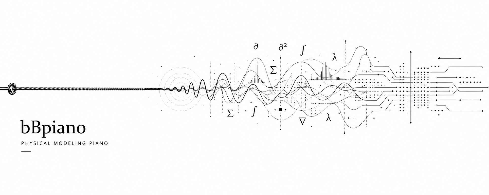

# bBpiano - bBSonicLab Physical Modeling


<hr>
<div align="center" style="line-height: 1;">
  <a href="https://github.com/opus-arc/bBpiano/actions/workflows/engine-evaluation.yml" target="_blank"></a>
  <br>   
  <a href="https://github.com/opus-arc/bBpiano/milestone/1" target="_blank"></a>
  <a href="https://github.com/opus-arc/bBpiano/milestone/1" target="_blank"></a>
  <br>
  <a href="https://opus-arc.github.io/bBpiano/"><b>Primary Research Document</b>👁️</a>
</div>

##     1. Introduction

bBpiano is a physical modeling piano synthesis project inspired by Pianoteq 9, currently in an active research and development stage. At its core is a physically modeled piano engine, designed to remain lightweight and responsive while capturing the immediacy, presence, and expressive vitality of a live instrument.

> [!IMPORTANT]
> Readers are strongly encouraged to begin with [**From PDE to PCM: Physical Modeling in the Digital Domain**][].
> The report documents the theoretical foundations, mathematical derivations, engineering implementation process, and design rationale behind bBpiano, providing a complete path from physical equations to a working piano synthesis engine.
>
> Read Online: https://opus-arc.github.io/bBpiano/

### **A Note from bBSonicLab**

bBpiano is released as an open research project.

It is neither the product of a large company nor the work of a dedicated acoustics institute. Much of it has been built through curiosity, experimentation, and countless attempts to understand problems that often seemed larger than the people studying them.

The project may be incomplete.

Its models may be imperfect.

Its understanding of the piano is certainly unfinished.

Yet we believe there is value in exploring these questions openly.

If previous generations left behind instruments, scores, recordings, and performances, perhaps our generation can also leave behind something of its own — algorithms, models, experiments, and a persistent desire to understand why sound moves us.

This repository is one small shelter built around that pursuit.

Whatever knowledge, craftsmanship, beauty, or mistakes are contained within it are shared in the hope that others may continue the journey further.

— bBSonicLab

## 2. **Project Philosophy**

Modern virtual pianos are predominantly based on sample playback. While high-quality sample libraries can achieve remarkable realism, they fundamentally rely on storing and replaying vast collections of recorded audio.

bBpiano explores a different direction.

Rather than preserving the sound of an instrument as recordings, bBpiano investigates whether it is possible to preserve the instrument itself.

The goal is not merely to reproduce waveforms, but to uncover the underlying principles that give rise to them — the relationships between vibration, energy, material, structure, and sound.

Through mathematics, parameters, and computation, bBpiano seeks to reconstruct the essence of an acoustic piano, and ultimately allow it to produce a sound that listeners can no longer reliably distinguish from the physical instrument that inspired it.

This approach offers several potential advantages:

- **Compact Representation**
   Instrument behavior is described by parameters and algorithms rather than multi-gigabyte sample libraries.
- **Continuous Expressiveness**
   Dynamics, articulation, and transitions emerge continuously from physical interactions rather than interpolation between discrete recordings.
- **Physical Interpretability**
   Individual acoustic phenomena can be analyzed, modified, measured, and improved directly within the model.
- **Scalability**
   Improvements to the underlying model benefit the entire instrument without requiring complete re-recording sessions.
- **Research Value**
   The instrument becomes an explorable physical system rather than a fixed collection of audio assets.

The long-term vision is to investigate whether physically modeled instruments can simultaneously achieve:

- the realism expected from modern professional instruments,
- the responsiveness required for live performance,
- the portability demanded by contemporary computing environments,
- and the compactness impossible for traditional sample-based approaches.

Ultimately, bBpiano asks a simple question:

Can the soul of an acoustic instrument be reconstructed through mathematics and computation alone?

## 3. bBpiano Physical Modeling Pipeline

```text
       Physics Domain
────────────────────────────

            MIDI
             ↓

         Key Model
             ↓

       Hammer Model
             ↓

     String Waveguide
             ↓
              
     Fractional Delay
             ↓

    Dispersion Network
             ↓

        Loss Filter
             ↓

      String Coupling
             ↓

           Bridge
             ↓

        Soundboard
```

```text
        Audio Domain
────────────────────────────

       Pickup y(x,t)
             ↓

        PCM Samples
             ↓

         Audio DAC
             ↓

           Sound
```

## 4. Quick Start

### Installation

```bash
brew install opus-arc/tap/bBpiano-L
```

## 5. Evaluation Results

To evaluate the acoustic realism and synthesis quality of bBpiano, we compare synthesized audio against reference recordings from the MAESTRO Yamaha Disklavier dataset. Baseline systems include Pianoteq 8 (physical modeling) and a conventional SF2 sampled piano. Current evaluations focus on model efficiency, representation-level similarity, and perceptual audio quality.

In addition to the MAESTRO Yamaha Disklavier dataset, selected evaluations also incorporate recordings from the Iowa Electronic Music Studios (Iowa EMS) Steinway Model B dataset. Since the Iowa dataset provides isolated piano recordings rather than aligned MIDI performances, note events and velocity information are automatically estimated using a pretrained piano transcription model to construct a unified benchmarking sequence. This allows direct comparisons between bBpiano, physical-modeling instruments, and sample-based pianos under controlled and reproducible conditions.

*Detailed test results and statistical data are included in the attachment below.*

### Engine Overview

| Category | Maestro Dataset | Pianoteq 8 | SF2 (Grand Piano) | bBpiano L0-Pizzicato |
|:----------|:----------:|:----------:|:----------:|:----------:|
| Type | Reference Recording | Physical Modeling | Sample-Based | Physical Modeling |
| Size | 1–10 GB (test subset) | **380 KB** | 36 MB | 641 KB |
| Real-Time Synthesis | ❌ | **✅** | ❌ | **✅** |
| Polyphony | N/A | **5 × 88** (M4) | N/A | 1.57 × 88 (M4) |

---

### VISQOL

VISQOL evaluates perceptual audio quality by estimating similarity between synthesized and reference recordings.

The Scale and Polyphony sections use Pianoteq 9 as the standard, while the standard reference recordings for the performance sections are taken from the Yamaha Disklavier subset in the MAESTRO dataset.  Higher values indicate stronger perceptual similarity to the reference recordings.

| Method | VISQOL Score |
|:---------|---------:|
| Pianoteq 9 | 2.8466 TBD |
| SF2 (Grand Piano) | 2.9008 TBD |
| bBpiano L0-Pizzicato | 2.2199 TBD |
| **bBpiano L0-100c** | 2.4260 TBD |
| bBpiano L0-beta | 2.3532 TBD |

---

### LAION-CLAP Similarity

The Scale and Polyphony sections use Pianoteq 9 as the standard, while the standard reference recordings for the performance sections are taken from the Yamaha Disklavier subset in the MAESTRO dataset. Higher values indicate a stronger similarity in the CLAP embedding space.

I believe the values provided by LAION-CLAP reflect more of an overall impression—such as tone, style, and mood—rather than physical accuracy. bBpiano aims to create a model that closely resembles a real piano, but isn’t limited to that style.

| Method | Cosine Similarity |
|:---------|---------:|
| Pianoteq 9 | 0.8045 |
| SF2 (Grand Piano) | **0.8283** |
| bBpiano L0-Pizzicato | 0.2261 |
| **bBpiano L0-100c** | 0.3213 |
| bBpiano L0-beta | 0.4628 |

---

### Historical Progress

| Category | Benchmark | bBpiano L0-alpha | bBpiano L0-beta | bBpiano L0-100c | bBpiano L0-Pizzicato |
|:---------|:---------|---------:|---------:|---------:|---------:|
| Engine | Binary Size | 1.04 MB | 1.04 MB | 1.1 MB | 641 KB |
| Engine | Real-Time Synthesis | Semi - ✅ | Semi - ✅ | Semi - ✅ | ✅ |
| Engine | Polyphony | 5.21 | 11.27 | 23.34 | 1.57 × 88 |
| LAION-CLAP | Cosine Similarity (MAESTRO Reference) | - | 0.4628 | 0.3213 |  |
| VISQOL | TBD (MAESTRO Reference) | - | 2.3532 | 2.4260 |  |

The values above represent the current state of the project and will continue to evolve as the physical model, hammer-string interaction, dispersion network, and parameter calibration pipeline mature.

## 6. License

This repository and all accompanying experimental data are currently released under the [PolyForm Internal Use License 1.0.0](https://github.com/opus-arc/bBpiano/blob/main/LICENSE).

## 7. Contact

If you have any questions, please raise an issue or contact us at arcopus07@gmail.com or https://t.me/arcopus .


---

# **Appendix A. ViSQOL Benchmark Details**

The following table provides the complete ViSQOL scores used to generate the aggregate results reported in Section 5.

The Scale and Polyphony sections use Pianoteq 9 as the standard, while the standard reference recordings for the performance sections are taken from the Yamaha Disklavier subset in the MAESTRO dataset.  Higher values indicate stronger perceptual similarity to the reference recordings.

## **A.1 Per-Piece Results**

### Scale: 

Scales across different pitch ranges; the primary focus of the test is on subsystems that are not affected by aliasing.

| Piece                                 | SF2 Grand Piano | bBpiano L0-Pizzicato | bBpiano L0-100c | bBpiano L0-beta |
| :------------------------------------ | --------------: | -------------------: | --------------: | --------------: |
| Bass_scale | **3.258543816** | | 2.279772871 | 2.494259218 |
| Tenor_scale | **2.294533822** | | 1.005804746 | 1.864653641 |
| Middle_scale | **2.880688398** | | 2.400253359 | 2.182012820 |
| Treble_scale | **2.836848379** | | 2.216778580 | 1.898298445 |
| High Treble_scale | **1.224602593** | | 1.047544827 | 1.093359043 |

### Polyphony:

Chords in different registers; the primary focus of the testing is the coupled system.

| Piece                                 | SF2 Grand Piano | bBpiano L0-Pizzicato | bBpiano L0-100c | bBpiano L0-beta |
| :------------------------------------ | --------------: | -------------------: | --------------: | --------------: |
| Bass_chords | **2.534555915** | | 2.077254981 | 2.166119601 |
| Tenor_chords | **2.672740293** | | 2.514874952 | 1.876183765 |
| Middle_chords | **3.429775842** | | 2.862829766 | 2.503931537 |
| Treble_chords | **2.521915846** | | 1.859617369 | 1.935985753 |
| High Treble_chords | **1.482525693** | | 1.222981887 | 1.139869631 |

### Perfomance:

This comprehensive test features performances selected from the MAESTRO dataset that, as much as possible, encompass the vast majority of techniques that demonstrate a piano’s quality.

| Piece                                 | Pianoteq 9 | SF2 Grand Piano | bBpiano L0-Pizzicato | bBpiano L0-100c | bBpiano L0-beta |
| :------------------------------------ | ---------: | --------------: | -------------------: | --------------: | --------------: |
| Etude-Tableaux Op.39 No.5             |     2.9136 |      **2.9863** |          2.285809614 |          2.6995 |          2.4852 |
| Images, Book II "Poissons d'or"       | **2.8029** |          2.7804 |          2.312521172 |          2.5644 |          2.3634 |
| Piano Sonata "From the Street"        |     2.9598 |      **3.0255** |          2.091438597 |          2.4664 |          2.3462 |
| Prel. Chor. Fug.                      |     2.9266 |      **3.0012** |          2.199275409 |          2.5196 |          2.2769 |
| Prelude and Fugue in A Minor, S.462/1 |     2.9671 |      **3.0924** |          2.336302759 |          2.5948 |          2.4029 |
| Prelude and Fugue in D Major, BWV 874 | **2.7859** |          2.6779 |          2.024254124 |          2.2438 |          2.2183 |
| Sonata No.28 Op.101                   |     2.8137 |      **2.8996** |          2.166522251 |          2.3586 |          2.3095 |
| Sonata No.4 Op.30                     |     2.7626 |      **2.8409** |          2.193601278 |          2.4185 |          2.2881 |
| Sonata in B Minor                     | **2.8854** |          2.8354 |          2.213168591 |          2.3827 |          2.2733 |
| Sonata in D Major K.576               |     2.8285 |      **3.0614** |          2.207048216 |          2.0482 |          2.4669 |
| Sonata in D Minor K.141               | **2.6867** |          2.5331 |          2.447243048 |          2.2945 |          2.4932 |
| Sonata in F Minor Op.5                |     2.9342 |      **2.9671** |          2.161659708 |          2.5207 |          2.3144 |

## **A.2 Aggregate Statistics**

| Engine               |       Mean |        Min |        Max |
| :------------------- | ---------: | ---------: | ---------: |
| Pianoteq 9           |     2.8466 | **2.6779** |     2.9671 |
| SF2 Grand Piano      | **2.9008** |     2.5331 | **3.0924** |
| bBpiano L0-Pizzicato |     2.2199 |     2.0243 |     2.4472 |
| bBpiano L0-100c      |     2.4260 |     2.0482 |     2.6995 |
| bBpiano L0-beta      |     2.3532 |     2.2183 |     2.4932 |

## **A.3 Reproducibility Notes**

- Reference dataset: Yamaha Disklavier (MAESTRO)
- Number of excerpts: 12
- Metric: ViSQOL
- Evaluation mode: pairwise comparison against aligned reference recordings

ViSQOL estimates perceptual audio similarity by modeling the relationship between spectral structures observed in the reference and synthesized signals. Higher scores indicate greater perceptual similarity to the original recording.

Unlike embedding-based metrics such as CLAP, ViSQOL directly evaluates the audio signals themselves and therefore serves as a complementary measure of synthesis quality.

> [!NOTE]
>
> An interesting observation is that while bBpiano L0-100c underperforms L0-beta in the CLAP benchmark, it achieves a slightly higher average ViSQOL score. This suggests that improvements in perceptual audio quality do not necessarily translate into higher embedding-space similarity, highlighting the importance of evaluating physical modeling instruments using multiple complementary metrics.


---

# Appendix B. CLAP Benchmark Details

The following table provides the complete per-piece LAION-CLAP similarity scores used to generate the aggregate results reported in Section 5.

The Scale and Polyphony sections use Pianoteq 9 as the standard, while the standard reference recordings for the performance sections are taken from the Yamaha Disklavier subset in the MAESTRO dataset. Higher values indicate a stronger similarity in the CLAP embedding space.

I believe the values provided by LAION-CLAP reflect more of an overall impression—such as tone, style, and mood—rather than physical accuracy. bBpiano aims to create a model that closely resembles a real piano, but isn’t limited to that style.

## B.1 Per-Piece Results

### Scale:

Scales across different pitch ranges; the primary focus of the test is on subsystems that are not affected by aliasing.

| Piece                                 | SF2 Grand Piano | bBpiano L0-Pizzicato | bBpiano L0-100c | bBpiano L0-beta |
| :------------------------------------ | --------------: | -------------------: | --------------: | --------------: |
| Bass_scale | 0.829674840 | | 0.591492534 | 0.387630433 |
| Tenor_scale | 0.896856070 | | 0.371731043 | 0.300049216 |
| Middle_scale | 0.720027626 | | 0.233823359 | 0.168149158 |
| Treble_scale | 0.718633533 | | 0.192326903 | 0.166393086 |
| High Treble_scale | 0.746628761 | | 0.304847121 | 0.317520738 |

### Polyphony:

Chords in different registers; the primary focus of the testing is the coupled system.

| Piece                                 | SF2 Grand Piano | bBpiano L0-Pizzicato | bBpiano L0-100c | bBpiano L0-beta |
| :------------------------------------ | --------------: | -------------------: | --------------: | --------------: |
| Bass_chords | **0.737208426** | | 0.712322891 | 0.491204530 |
| Tenor_chords | **0.898284912** | | 0.612981141 | 0.465305507 |
| Middle_chords | **0.782639027** | | 0.344589412 | 0.309159577 |
| Treble_chords | **0.825937271** | | 0.233994871 | 0.203228608 |
| High Treble_chords | **0.679073453** | | 0.220188931 | 0.261892319 |

### Perfomance:

This comprehensive test features performances selected from the MAESTRO dataset that, as much as possible, encompass the vast majority of techniques that demonstrate a piano’s quality.

| Piece                                 | Pianoteq 9 | SF2 Grand Piano | bBpiano L0-Pizzicato | bBpiano L0-100c | bBpiano L0-beta |
| :------------------------------------ | ---------: | --------------: | -------------------: | --------------: | --------------: |
| Etude-Tableaux Op.39 No.5             |     0.7640 |      **0.8494** |          0.244967222 |          0.3476 |          0.5452 |
| Images, Book II "Poissons d'or"       | **0.7816** |          0.7704 |          0.225847974 |          0.4385 |          0.4862 |
| Piano Sonata "From the Street"        | **0.8993** |          0.8060 |          0.159824803 |          0.1505 |          0.5820 |
| Prel. Chor. Fug.                      |     0.7994 |      **0.8852** |          0.284094602 |          0.4831 |          0.4735 |
| Prelude and Fugue in A Minor, S.462/1 | **0.9413** |          0.8776 |          0.289103746 |          0.5253 |          0.6226 |
| Prelude and Fugue in D Major, BWV 874 |     0.6436 |      **0.8413** |          0.006589664 |          0.1691 |          0.4318 |
| Sonata No.28 Op.101                   |     0.7851 |      **0.8338** |          0.252199650 |          0.3241 |          0.4066 |
| Sonata No.4 Op.30                     |     0.7962 |      **0.8154** |          0.187488467 |          0.4225 |          0.5763 |
| Sonata in B Minor                     | **0.7088** |          0.7059 |          0.316080213 |          0.2329 |          0.5579 |
| Sonata in D Major K.576               | **0.8754** |          0.8503 |          0.239892751 |          0.2747 |          0.4318 |
| Sonata in D Minor K.141               | **0.8897** |          0.8641 |          0.354716450 |          0.2403 |          0.2966 |
| Sonata in F Minor Op.5                |     0.7701 |      **0.8401** |          0.151858717 |          0.2468 |          0.1436 |

## B.2 Aggregate Statistics

| Engine               |       Mean |        Min |        Max |
| :------------------- | ---------: | ---------: | ---------: |
| Pianoteq 9           |     0.8045 |     0.6436 | **0.9413** |
| SF2 Grand Piano      | **0.8283** | **0.7059** |     0.8852 |
| bBpiano L0-Pizzicato |   0.2261ok |     0.0066 |     0.3547 |
| bBpiano L0-100c      |     0.3213 |     0.1505 |     0.5253 |
| bBpiano L0-beta      |     0.4628 |     0.1436 |     0.6226 |

## B.3 Reproducibility Notes

- Reference dataset: Yamaha Disklavier (MAESTRO)
- Number of excerpts: 12
- Embedding model: LAION-CLAP
- Similarity metric: cosine similarity

Repeated evaluations indicate that CLAP exhibits measurable stochastic variation. Under identical conditions, fluctuations of approximately 5–10% are common, while deviations exceeding 30% have occasionally been observed. Consequently, CLAP scores should be interpreted as approximate perceptual indicators rather than absolute measures of acoustic realism.

> [!NOTE]
>
> Although the benchmark results of **bBpiano L0-100c** are not as impressive as we had hoped, we still consider it one of our most meaningful models. Compared with the earlier L0-beta version, L0-100c represents an attempt to strike a balance between physical accuracy derived from real-world measurements and the pursuit of a beautiful, musically satisfying tone. Through this process, it gradually developed a unique voice and aesthetic character of its own. Whatever its position in the benchmark tables, it remains a model with a strong personality, carrying within it countless experiments, revisions, and the genuine effort of those who created it.


**bBSonicLab**



 


