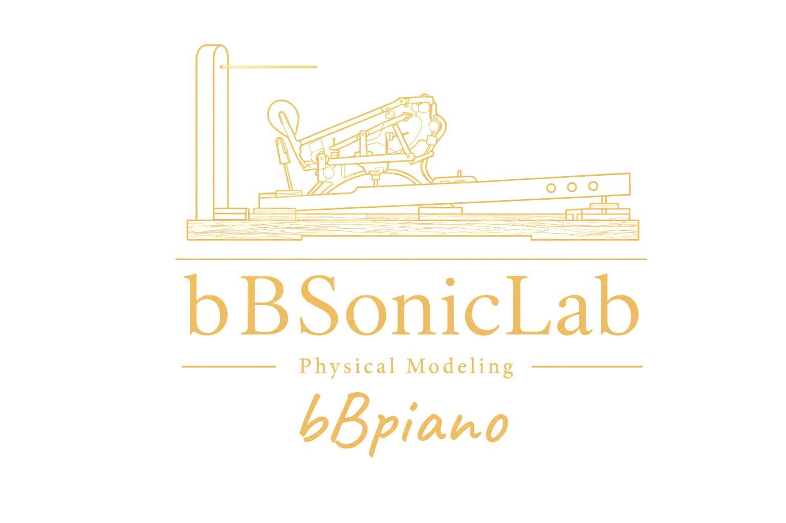

# bBpiano - bBSonicLab Physical Modeling



<hr>
<div align="center" style="line-height: 1;">
  <a href="https://github.com/opus-arc/bBpiano/actions/workflows/swift.yml" target="_blank"></a>
  <a href="https://github.com/opus-arc/bBpiano/actions/workflows/engine-evaluation.yml" target="_blank"></a>
  <a href="https://github.com/opus-arc/bBpiano/actions/workflows/ci.yml" target="_blank"></a>
  <br>   
  <a href="https://github.com/opus-arc/bBpiano/milestone/1" target="_blank"></a>
  <a href="https://github.com/opus-arc/bBpiano/milestone/1" target="_blank"></a>
  <br>
  <a href="https://opus-arc.github.io/bBpiano/"><b>Primary Research Document</b>👁️</a>
</div>

##     1. Introduction

bBpiano is a physical modeling piano synthesis project inspired by Pianoteq 9, currently in an active research and development stage. At its core is a physically modeled piano engine, designed to remain lightweight and responsive while capturing the immediacy, presence, and expressive vitality of a live instrument.

> [!IMPORTANT]
> Readers are strongly encouraged to begin with [**From PDE to PCM: Physical Modeling in the Digital Domain**][].
> The report documents the theoretical foundations, mathematical derivations, engineering implementation process, and design rationale behind bBpiano, providing a complete path from physical equations to a working piano synthesis engine.
>
> Read Online: https://opus-arc.github.io/bBpiano/

### **A Note from bBSonicLab**

bBpiano is released as an open research project.

It is neither the product of a large company nor the work of a dedicated acoustics institute. Much of it has been built through curiosity, experimentation, and countless attempts to understand problems that often seemed larger than the people studying them.

The project may be incomplete.

Its models may be imperfect.

Its understanding of the piano is certainly unfinished.

Yet we believe there is value in exploring these questions openly.

If previous generations left behind instruments, scores, recordings, and performances, perhaps our generation can also leave behind something of its own — algorithms, models, experiments, and a persistent desire to understand why sound moves us.

This repository is one small shelter built around that pursuit.

Whatever knowledge, craftsmanship, beauty, or mistakes are contained within it are shared in the hope that others may continue the journey further.

— bBSonicLab

## 2. **Project Philosophy**

Modern virtual pianos are predominantly based on sample playback. While high-quality sample libraries can achieve remarkable realism, they fundamentally rely on storing and replaying vast collections of recorded audio.

bBpiano explores a different direction.

Rather than preserving the sound of an instrument as recordings, bBpiano investigates whether it is possible to preserve the instrument itself.

The goal is not merely to reproduce waveforms, but to uncover the underlying principles that give rise to them — the relationships between vibration, energy, material, structure, and sound.

Through mathematics, parameters, and computation, bBpiano seeks to reconstruct the essence of an acoustic piano, and ultimately allow it to produce a sound that listeners can no longer reliably distinguish from the physical instrument that inspired it.

This approach offers several potential advantages:

- **Compact Representation**
   Instrument behavior is described by parameters and algorithms rather than multi-gigabyte sample libraries.
- **Continuous Expressiveness**
   Dynamics, articulation, and transitions emerge continuously from physical interactions rather than interpolation between discrete recordings.
- **Physical Interpretability**
   Individual acoustic phenomena can be analyzed, modified, measured, and improved directly within the model.
- **Scalability**
   Improvements to the underlying model benefit the entire instrument without requiring complete re-recording sessions.
- **Research Value**
   The instrument becomes an explorable physical system rather than a fixed collection of audio assets.

The long-term vision is to investigate whether physically modeled instruments can simultaneously achieve:

- the realism expected from modern professional instruments,
- the responsiveness required for live performance,
- the portability demanded by contemporary computing environments,
- and the compactness impossible for traditional sample-based approaches.

Ultimately, bBpiano asks a simple question:

Can the soul of an acoustic instrument be reconstructed through mathematics and computation alone?

## 3. bBpiano Physical Modeling Pipeline

```text
       Physics Domain
────────────────────────────

            MIDI
             ↓

         Key Model
             ↓

       Hammer Model
             ↓

     String Waveguide
             ↓
              
     Fractional Delay
             ↓

    Dispersion Network
             ↓

        Loss Filter
             ↓

      String Coupling
             ↓

           Bridge
             ↓

        Soundboard
```

```text
        Audio Domain
────────────────────────────

       Pickup y(x,t)
             ↓

        PCM Samples
             ↓

         Audio DAC
             ↓

           Sound
```

## 4. Quick Start

### Installation

```bash
brew install opus-arc/tap/bBpiano-L
```

## 5. Evaluation Results

To evaluate the acoustic realism and synthesis quality of bBpiano, we compare synthesized audio against reference recordings from the MAESTRO Yamaha Disklavier dataset. Baseline systems include Pianoteq 8 (physical modeling) and a conventional SF2 sampled piano. Current evaluations focus on model efficiency, representation-level similarity, and perceptual audio quality.

In addition to the MAESTRO Yamaha Disklavier dataset, selected evaluations also incorporate recordings from the Iowa Electronic Music Studios (Iowa EMS) Steinway Model B dataset. Since the Iowa dataset provides isolated piano recordings rather than aligned MIDI performances, note events and velocity information are automatically estimated using a pretrained piano transcription model to construct a unified benchmarking sequence. This allows direct comparisons between bBpiano, physical-modeling instruments, and sample-based pianos under controlled and reproducible conditions.

### Engine Overview

| Category | Maestro Dataset | Pianoteq 8 | SF2 (Grand Piano) | bBpiano L0-100c(Provisional) |
|:----------|:----------:|:----------:|:----------:|:----------:|
| Type | Reference Recording | Physical Modeling | Sample-Based | Physical Modeling |
| Size | 1–10 GB (test subset) | **380 KB** | 36 MB | 1.04 MB |
| Real-Time Synthesis | ❌ | **✅** | ❌ | **✅** |
| Polyphony | N/A | **> 88** | N/A | **23.34** |

---

### LAION-CLAP Similarity

Reference recordings are taken from the MAESTRO Yamaha Disklavier dataset. Cosine similarity is computed in the LAION-CLAP embedding space, where higher values indicate stronger acoustic similarity to the reference performance.

| Method | Cosine Similarity |
|:---------|---------:|
| Pianoteq 8 | **1.000000** |
| SF2 (Grand Piano) | 0.844363 |
| bBpiano L0-100c(Provisional) | - |

Pianoteq serves as an approximate upper bound rather than a direct competitor.

The purpose of this benchmark is to establish a reference point for future iterations of the physical model rather than to claim parity with commercial instruments.

---

### VISQOL

VISQOL evaluates perceptual audio quality by estimating similarity between synthesized and reference recordings.

| Method | VISQOL Score |
|:---------|---------:|
| Pianoteq 8 | 5.000 TBD |
| SF2 (Grand Piano) | 2.736 TBD |
| bBpiano L0-100c(Provisional) | - TBD |

---

### Partial Analysis

Spectral partial analysis measures how accurately the synthesized instrument reproduces the harmonic structure of the reference piano.

| Method | Dispersion | Loss |
|:---------|---------:|----------|
| RT425 | Standard | Standard |
| Pianoteq 8 | - | - |
| SF2 (Grand Piano) | - | - |
| bBpiano L0-100c(Provisional) | <1hz | >30% |

---

### Historical Progress

| Category | Benchmark | bBpiano L0-alpha | bBpiano L0-beta | bBpiano L0-100c(Provisional) |
|:---------|:---------|---------:|---------:|----------|
| Engine | Binary Size | — | 1.04 MB | - |
| Engine | Real-Time Synthesis | Semi - ✅ | Semi - ✅ | ✅ |
| Engine | Polyphony | 5.21 | 11.27 | >88 |
| LAION-CLAP | Cosine Similarity (Pianoteq Reference) | 0.538950 | 0.538950 | - |

The values above represent the current state of the project and will continue to evolve as the physical model, hammer-string interaction, dispersion network, and parameter calibration pipeline mature.

## 6. License

This repository and all accompanying experimental data are currently released under the [PolyForm Internal Use License 1.0.0](https://github.com/opus-arc/bBpiano/blob/main/LICENSE).

## 7. Contact

If you have any questions, please raise an issue or contact us at arcopus07@gmail.com or https://t.me/arcopus .


