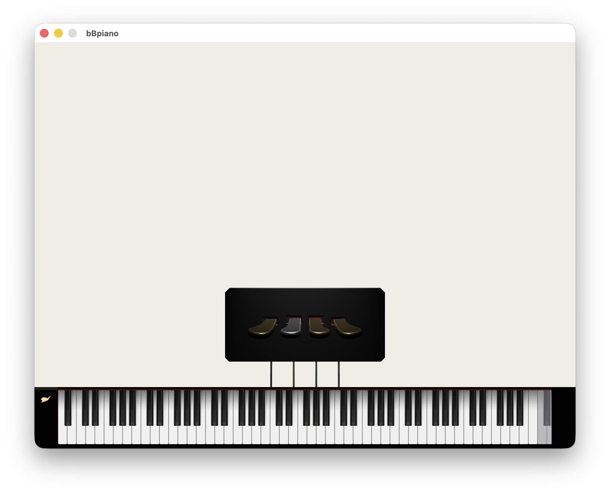
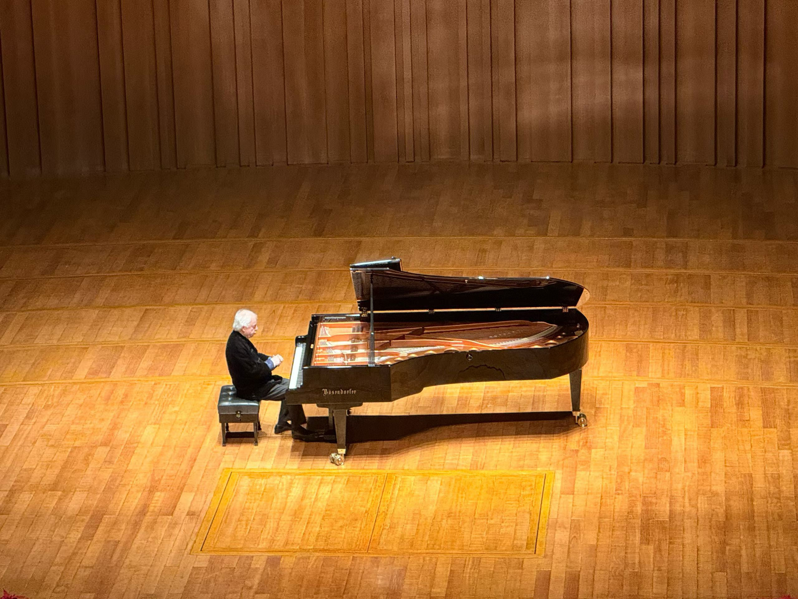

# From PDE to PCM: Physical Modeling in the Digital Domain

# 从波动方程到物理建模


 [](https://github.com/opus-arc/bBpiano/actions/workflows/swift.yml)

[](https://github.com/opus-arc/bBpiano/actions/workflows/engine-evaluation.yml)

[](https://github.com/opus-arc/bBpiano/milestone/1)

[](https://github.com/opus-arc/bBpiano/milestone/1)

[](https://github.com/opus-arc/bBpiano/actions/workflows/ci.yml)

**Authors:** Ziyang Tan, Zhuoran Chen  
*(hereinafter referred to as Z. Tan and Z. Chen)*

---



## Preface

## 前言

 All questions and research begin with a fundamental problem:

所有问题与研究都始于一个根本问题：

> **How can we represent musical instruments efficiently and accurately in terms of parameters and code?**  

> **我们如何高效且准确地将乐器转化为参数与代码？**

This work attempts to answer this question by starting from the most fundamental physical model and progressively building toward practical implementations.

本文试图从最基础的物理模型出发，逐步构建通向工程实现的路径，以回答这一问题。

---

## 1 Introduction  

## 1 引言

As pointed out in previous work, the piano is a particularly interesting instrument due to both its prominence in Western music and its complex physical structure.

正如已有研究所指出的，钢琴是一种非常具有代表性的乐器，不仅因为其在西方音乐中的重要地位，也因为其复杂的物理结构。

> *“The piano is a particularly interesting instrument, both for its prominence in western music and for its complex structure. Also, its control mechanism is simple (it basically reduces to key velocity), and physical control devices (MIDI keyboards) are widely available which is not the case for other instruments.”*  
>
> *“The source-based approach can be useful not only for synthesis purposes but also for gaining a better insight into the behavior of the instruments. However, as we are interested in efficient algorithms, the features modeled are only those considered to have audible effects. In general, there is a trade-off between the accuracy and the simplicity of the description.”*  
>
> — Bank et al., 2003

From an engineering perspective, this observation leads to a central question:

从工程角度来看，这一观察引出了一个核心问题：

> **How can we balance physical accuracy and computational efficiency in sound synthesis?**  

> **我们如何在物理真实与计算效率之间取得平衡？**

---

## 2 Research history

## 2 研究历史

全量化地建模任何一种乐器都绝非易事，尽管本文会声明钢琴是主要的研究对象，但钢琴拥有极其庞杂的物理信息，我相信在这样的研究过程中，我将听到的声音大部分也和钢琴本身没有太大关系，但同时也不难发现的是，物理方法建模钢琴并非一朝一夕，早在1987年Garnett就尝试通过数字波导替代全离散PDE的方法来模拟钢琴的全部系统….


---

## About bBpiano

## 关于 bBpiano

**bBpiano** 是一个受到 **Pianoteq 9** 启发、目前仍在积极开发中的 macOS 钢琴合成器项目。它以内置的物理建模钢琴引擎为核心，试图在保持轻量、实时响应的同时，捕捉真实乐器演奏时的直接性、存在感与声音生命力。

这不仅是一个合成器项目，也是一次从物理方程到实时音频系统的完整研究实践。bBpiano 试图在数学模型、声学直觉、数值算法与现代软件工程之间建立一条清晰路径：从 PDE 到 PCM，从弦的振动到可听见的声音，从抽象公式到可运行的乐器。

若您对物理建模合成、钢琴声学、数字信号处理或实时音频系统有所兴趣，欢迎交流讨论；也诚挚期待相关领域的前辈、研究者与开发者不吝指教。


邮箱: arcopus07@gmail.com

微信号: opus_arc


**bBpiano** is a macOS piano synthesizer project inspired by **Pianoteq 9**, currently under active development. At its core is a physically modeled piano engine, designed to remain lightweight and responsive while capturing the immediacy, presence, and expressive vitality of a live instrument.

The project is not merely an attempt to build a synthesizer, but a complete research practice that moves from physical equations to a real-time audio system. It seeks to establish a clear path between mathematical models, acoustic intuition, numerical algorithms, and modern software engineering: from PDE to PCM, from string vibration to audible sound, from abstract formulas to a playable instrument.

For those interested in physical modeling synthesis, piano acoustics, digital signal processing, or real-time audio systems, discussions and exchanges are warmly welcome. I would also sincerely appreciate guidance and criticism from researchers, developers, and experienced practitioners in related fields.


Gmail: arcopus07@gmail.com

Wechat: opus_arc


___

## 1 Pulse Code Modulation

## **1 脉冲编码调制**

<sup>This chapter was developed based on the research and implementation work of Z. Tan.</sup>

在物理层面中**声音的本质是介质中的压力扰动传播**，可对于现代人来说，我接触到的声音通常都不是由一个物理声源发出，而是通过声卡，尽管我很想顺便研究声卡的工作原理，但作为一般情况下的最终输出，还是决定从PCM入手，所有的发声引擎都遵循：


>  UI 指令  -  引擎  -  PCM 流  -  声卡


如果我想在研究的过程中实时听到效果，我必须从右端开始并逐渐向左研究

**PCM（Pulse Code Modulation，脉冲编码调制）是一种将连续模拟信号转换为离散数字信号**的方法，广泛用于音频采集、存储与传输。

生成 PCM 需要完成三个步骤

1. **采样（Sampling）**：把连续时间信号变成离散时间点

   根据**奈奎斯特定理（Nyquist Theorem）**，为了避免**混叠（aliasing）**，**采样率（sampleRate）必须大于或等于信号最高频率的 2 倍**，**人耳上限约 20 kHz**，故至少需要 40 kHz 的采样率，也就是至少要一秒钟记录音频函数 $y(x,t)$ 在 **$x=pickup$ （拾音点，pickup point）**的 $y$ 值 40000 次， $y(x,t)$ 是关于空间与时间的函数，而这基本上也是声音的本质，这在后文会逐步解释，此处的拾音方式除了定点，还有多弦耦合或者分布式拾音，在后文或许都会解释

   这里还需要补充一点，因为我只讨论了单声道的情况，然而当多个采样数据相互叠加，就会出现多个声道，关于多声道的采样，我们需要讨论 channel 的值

   其实无论是采样还是播放 ，都需要 sampleRate、channel 两个信息作为支撑，sampleRate 在播放时的作用基于上文的解释就很好理解了，它能告诉播放器 PCM 数组从一个定点位置开始往后多少个 sample 是一秒之内的内容，而 channel 则使得播放器能区分不同声道的数据

   我们以双声道为例，

   假设数据为 [0.43214224, -0.10, 0.2222345, 0, 0, 0.78, 1, -1]

   在绝大多数音频系统中（WAV、CoreAudio、ASIO、VST 等）：

   **立体声 PCM 默认顺序是：Left → Right（LRLRLR…）** 

   用代码分离左右声道的方式如下：

   ```c
   int16_t* data;
   
   for (int i = 0; i < numFrames; i++) {
       int16_t left  = data[i * 2 + 0]; // 左声道
       int16_t right = data[i * 2 + 1]; // 右声道
   }
   ```

   用示例的数据能得到如下的结果：

   

   > Left = [0.43214224, 0.2222345, 0, 1]
   >
   > Right = [-0.10, 0, 0.78, -1]

   这样就区分了不同声道的数据。

   

   基于上述的内容，通过  $y(pickup,t)$，sampleRate,  channel，我们能够得到一个关于 y 在 $t2-t1$ 间的 $y$ 的离散数组

   

2. **量化（Quantization）**：把连续幅值变成有限级别

   通过采样获得的离散数组从数值上并不能直接喂给声卡，因为函数是理论无限连续的，采样时的精度完全取决于小数点后保留的位数，这显然是不可靠的，声卡作为一种物理器械有它固定的精度，现代声卡的精度（比如我的 Macbook Air 2025）， 尽管系统 Core Audio 的处理精度是 **32-bit float**，但声卡的最终输出（DAC）精度是 **24-bit float**，DAC是声卡中的一个核心部件，它的作用是将PCM转换成模拟电压然后传给放大器然后声音从喇叭放出。

   在解释精度的详细运算之前，我需要先解释**归一化**，也就是把采样离散数组无损映射在 $[-1,1]$ 之间，但我需要声明的是，这样的操作也不是必须的，

   我们假设可用值（精度）只有 3 bit（8 个等级，算法：$2^3 = 8 $  接着归一化离散）：
   -1.0, -0.75, -0.5, -0.25, 0, 0.25, 0.5, 0.75

   如果采样值是：0.68

   那就会根据如下的公式

   $x_q[n] = round(x[n] / Δ) * Δ$

   “找最近的台阶”，量化后为 0.75 ，

   如此一来这就在没有归一化的情况下量化了采样值，

   但假设采样值为 2.3，就会发生被截断为1，产生**clipping（削波）**从而**严重失真（clipping distortion）**

   故在量化之前进行归一化是为了避免这样对声音的影响，

   在有了这样的教训之后，我把采样数组统一地压缩为类似 [0.43214224, -0.10, 0.2222345, 0, 0, 0.78, 1, -1] 这样的形式再进行归一化

   

3. **编码（Encoding）**：把量化值转成二进制数据 

   > 模拟值 → 量化等级 → 二进制
   > 0.73 → Level 187 → 10111011

   接着通过声卡就能听见声音


不难看出，整个工作流最后的输出都将以PCM流的方式呈现

接着我会尝试使用 cpp 编写 y(x,t) （音频波）的生成器，选用 Swift 编写接收并加工这一信息的声卡接口

C++ 在音频加工的领域拥有极好的生态，而 swift 拥有优美与完善的硬件生态，这是我选用这两种语言的原因

先谈 swift 应该接收什么样的数据类型：

```swift
//  Created by opus arc on 2026/4/3.

private func render(
        frameCount: AVAudioFrameCount,
        audioBufferList: UnsafeMutablePointer<AudioBufferList>
    ) -> OSStatus {
        // 复制一份 bufferList
        let bufferList = UnsafeMutableAudioBufferListPointer(audioBufferList)
        // 通常来说只有一个 buffer，但是通过遍历的方式能更通用
        for buffer in bufferList {
            // 取出底层数据指针，这是裸内存地址，指向真正的音频采样区。
            // 这里用 guard let 就是为了确保数据不为空
            // 这一步获取了这块内存上的数据
            guard let mData = buffer.mData else { continue }
            // 这里 assumingMemoryBound 的用法是：
            // “我知道这块内存其实就是 Float 类型，请按 Float* 来看待它。”
            // 也就是说我们此处我们保证计算机用 float 的格式看待这个数据
            let out = mData.assumingMemoryBound(to: Float.self)
            for frame in 0..<Int(frameCount) {
                // 为这个 buffer 的每一帧生成数据
                if isPlayingTone {
                    let sample = sin(2.0 * Double.pi * phase)
                    // 这一步就是限制总音量，并排除削波
                    out[frame] = Float(sample) * amplitude
                    // 一秒钟 frequency 个周期
                    // 一秒钟 sampleRate 帧
                    // frequency / sampleRate 为几周期一帧
                    // 而 phase 从 0~1 就代表一个周期
                    // 故此处加工的数据是1帧要前进多少个周期
                    // 这样便能解释这里的表达式
                    phase += frequency / sampleRate
                    // 当走完一个周期，就回到原点
                    if phase >= 1.0 {
                        phase -= 1.0
                    }
                } else {
                    out[frame] = 0.0
                }
            }
        }
        return noErr
    }
```

<audio controls>
  <source src="./Doc/audio/440Hz%E6%AD%A3%E5%BC%A6%E6%B3%A2.wav" type="audio/wav">
</audio>

这是桥接 PCM 数据和声卡的 swift 最核心的部分代码，**AVAudioSourceNode **是一个“源节点”，我们可以写入自己的数据，这也是 Apple 提供的实时合成音频的关键工具。

这其中还包含了一个很经典的正弦波的生成方式，不是通过 $ct$ 而是通过归一化 $phase$ [0, 1] 使得正弦图像变动起来

不过当然，我们需要的音频函数仍然需要通过 C++ 来生成，我们需要编写 cpp 和 swift 的桥接代码，理论上来说 WWDC 2023 session 10172: [Mix Swift and C++](https://developer.apple.com/wwdc23/10172)  Swift 5 提出了一种基于 framework 能够直接暴露 C++ API 的特性，但经过多轮测试，这样的方式仍然存在许多潜在的 bug 与坏处，偶发的闪退与内存出错令我略为沮丧，此处我们还是使用传统桥接的方式：

<p align="center">  
  
</p>


不过这里需要提醒的是，在 xcode 中我们尽量通过模版进行新建，而不要通过 empty file 修改后缀或者将其他文件直接拖进来，如果采取了后者的方式，也一定要 xcode 中补充好相关的配置


我们先通过这样正确的方式创建 main.hpp 文件

```cpp
//
//  main.hpp
//  bBpiano
//
//  Created by opus arc on 2026/4/4.
//

#ifndef main_hpp
#define main_hpp

#ifdef __cplusplus
extern "C" {
#endif

void say_hello();

#ifdef __cplusplus

}
#endif

#endif /* main_hpp */

```

这实际上是一个**ABI 边界声明文件（C-compatible interface header）**，由于 C++ 会自动修饰名称的默认行为，我们所写的 say_hello 可能在编译的过程中变成类似 _Z9say_hellov 这样的名字， Swift 通过 C ABI 调用函数，而 C 将无法理解这样的名称，于是我们使用这样的方式：

```cpp
extern "C" {
    void say_hello();
}
```

关闭**C++ name mangling**，让符号变成纯 C ABI

然后我们新建 cpp 文件写下它的实现：

```cpp
//
//  Created by opus arc on 2026/4/4.
//

#include "main.hpp"
#include <iostream>

void say_hello() {
    std::cout << "Hello World from C++" << std::endl;
}

```

然后通过至关重要的一步，通过 xxxx-Bridging-Header.h 来暴露 cpp header ，如果使用模版创建 cpp 文件，xcode 会自动生成这样一个文件，我们只需要加上一个 include， 确保 Swift 能看到这个头文件：

```cpp
//
//  Use this file to import your target's public headers that you would like to expose to Swift.
//

#include "main.hpp"
```

于是我们在同一个 target 下的任意 swift 文件中都可以调用 say_hello() 这个函数：

<p align="center">  
  
</p>


这样的输出正是我想看到的，这代表着 C++ 和 Swift 的桥接完成，接下来我们来编写 C++ 应对 Swift 类对于 buffer 的请求，

这里我需要做出一些解释，因为从常理上看，即便声音信号不是由 C++ 文件主动激发，用户指令也是由 UI 传递出来，无论如何都不会由声卡来 “要” 数据，这其实很奇怪，最好的情况是当然是想让声卡发出声音时，调用一个类似 playSound(buffer) 的函数，但实际上的情况是，每当遇到这样软件和硬件的边界时，软件总是要主动遵循硬件的工作机理，声卡并非是灵活的，且事实上我们并不知道上一个 buffer 何时播放结束，故实际上我们需要写的调用逻辑是 Swift 调用 C++

既然之前用 Swift 写出了正弦波，那此次用 Cpp 尝试写一个方波：

```cpp
void get_next_buffer(float* buffer, int frameCount, double amplitudeLimiter) {
    for(int i = 0; i < frameCount; i++) {
        // 音频代码需要显示强调类型
        if (phase < 0.5)
            buffer[i] = static_cast<float>(amplitudeLimiter);
        else
            buffer[i] = static_cast<float>(-amplitudeLimiter);
        phase += frequency / sampleRate;
        if(phase >= 1.0) phase -= 1.0;
    }
}
```

这个逻辑会产生一个 **440Hz 的 50% duty 方波**，我们通过桥接使得 Swift 能够调用这里的函数：

```swift
private func render(
        frameCount: AVAudioFrameCount,
        audioBufferList: UnsafeMutablePointer<AudioBufferList>
    ) -> OSStatus {
        // 复制一份 bufferList
        let bufferList = UnsafeMutableAudioBufferListPointer(audioBufferList)
        // 通常来说只有一个 buffer，但是通过遍历的方式能更通用
        for buffer in bufferList {
            // 取出底层数据指针，这是裸内存地址，指向真正的音频采样区。
            // 这里用 guard let 就是为了确保数据不为空
            // 这一步获取了这块内存上的数据
            guard let mData = buffer.mData else { continue }
            // 这里 assumingMemoryBound 的用法是：
            // “我知道这块内存其实就是 Float 类型，请按 Float* 来看待它。”
            // 也就是说我们此处我们保证计算机用 float 的格式看待这个数据
            let out = mData.assumingMemoryBound(to: Float.self)
            get_next_buffer(
                out,
                Int32(frameCount),
                Double(amplitudeLimiter)
            )
        }
        return noErr
    }
```

<audio controls>
  <source src="./Doc/audio/440Hz50%25duty%E6%96%B9%E6%B3%A2.wav" type="audio/wav">
</audio>

通过上述的实践，我搭建了一个非常简易的 **DSP, Digital Signal Processing（数字信号处理）**模型


___

## 2 The One-Dimensional String Model

## 2 一维弦振动模型

<sup>This chapter was developed based on the research and implementation work of Z. Tan.</sup>

检验一个建模的好坏，最好的方式就是倾听它所发出的声响，上一章节我已经搭建了让我们聆听到音频函数的装置，这里我会尝试编写相对进阶一些的音频函数，我聚焦钢琴最核心的部分，尽管我明白击弦锤和音板都同等重要，但钢琴的主要储能部分仍然是弦，作为工程最开始的最简模型，为了简易地描述钢琴声响的由来，我需要检验这种扰动的根源: 弦的振动方程

令人困扰的是，结合前文关于**PCM采样**的论述，**PCM 的理论采样对象应当是空气中的声压时间函数，而不是机械系统本身的位移函数**，但为了衔接上文的 C++ 函数，我想先陈述这样一个命题：


> **命题： 在一维理想弦的小振幅线性模型中，弦上某一固定点 x_p 的位移随时间的变化  y(x_p,t)，可以作为该弦最终辐射声压频率内容的一个近似代表**


这样一个命题决定了我们计算出来的弦的位移模型正是 PCM 采样可以接受的模型，但在理解这个命题之前，我需要先论证一维弦振动模型：


“连续体”（continuum）是一种理想化模型，其核心含义是：**物质在空间中被视为连续分布的介质，而非由离散粒子组成**。这一假设使得我们可以用连续函数来描述物理量（如密度、速度、温度等）在空间和时间中的变化。在宏观尺度上，忽略物质的分子或原子结构，将其视为连续分布。

我不能够分别地去描述弦上每一个原子的运动过程，但弦在宏观上正是一个连续体

故弦在位置 x 时间 t 的位移 y 可以用连续函数 $y(x,t)$ 描述

我们引出一维弦振动公式并尝试证明它，这也是本文的第一个 **PDE = Partial Differential Equation** 偏微分方程: 

考虑一根拉紧的弦：弦的平衡位置沿 x 轴，横向位移记为 y(x,t)，弦上的张力大小为 T，线密度（单位长度质量）为  $\mu$

假设：振动很小，弦的伸长可以忽略，张力 T 近似处处相同，只考虑横向运动

取一小段弦元，取弦上从 $x$ 到 $x+\Delta x$ 的一小段，这小段弦两端都受张力，方向沿弦的切线方向。

左端张力：$T$，与 $x$ 轴夹角为 $\theta(x,t)$

右端张力：$T$，与 $x$ 轴夹角为 $\theta(x+\Delta x,t)$

因为只考虑横向振动，所以我们看 y 方向的受力。

列牛顿第二定律：

这段弦元质量为 \(\mu \Delta x\)，横向加速度约为
```math
\frac{\partial^2 y}{\partial t^2}
```

因此横向合力满足
```math
\mu \Delta x \frac{\partial^2 y}{\partial t^2}
=
T\sin\theta(x+\Delta x,t)-T\sin\theta(x,t)
```

即
```math
\mu \Delta x \frac{\partial^2 y}{\partial t^2}
=
T\bigl[\sin\theta(x+\Delta x,t)-\sin\theta(x,t)\bigr]
```

因为振动很小，弦的斜率很小，所以
```math
\tan\theta
\approx
\sin\theta
\approx
\frac{\partial y}{\partial x}
```

于是
```math
\sin\theta(x,t)
\approx
\frac{\partial y}{\partial x}(x,t)
```

```math
\sin\theta(x+\Delta x,t)
\approx
\frac{\partial y}{\partial x}(x+\Delta x,t)
```

代回去：
```math
\mu \Delta x \frac{\partial^2 y}{\partial t^2}
=
T\left[
\frac{\partial y}{\partial x}(x+\Delta x,t)
-
\frac{\partial y}{\partial x}(x,t)
\right]
```

化为二阶空间导数，并将上式除以 \(\Delta x\)：
```math
\mu \frac{\partial^2 y}{\partial t^2}
=
T
\frac{
\frac{\partial y}{\partial x}(x+\Delta x,t)
-
\frac{\partial y}{\partial x}(x,t)
}{
\Delta x
}
```

令 \( \Delta x\to 0\)，右边变成二阶导数：
```math
\mu \frac{\partial^2 y}{\partial t^2}
=
T\frac{\partial^2 y}{\partial x^2}
```

于是得到
```math
\frac{\partial^2 y}{\partial t^2}
=
\frac{T}{\mu}
\frac{\partial^2 y}{\partial x^2}
```

记
```math
c^2=\frac{T}{\mu}
```

便是波动方程：
```math
\frac{\partial^2 y}{\partial t^2}
=
c^2
\frac{\partial^2 y}{\partial x^2}
```

其中
```math
\frac{\partial^2 y}{\partial t^2}
```

是横向加速度 \(a\)。

当时间 \(t\) 固定时，\(y(x,t)\) 可以看作弦在某一瞬间的空间形状。因此
```math
\frac{\partial^2 y}{\partial x^2}
```

描述的是该瞬间波形相对于空间位置 \(x\) 的二阶变化，也就是在小斜率近似下的曲率 \(\kappa\)。

于是可以写成
```math
a=c^2\kappa
```

也即：

```math
\text{加速度}
=
\text{波速}^2
\times
\text{曲率}
```

这个方程的通解是：
```math
y(x,t)=f(x-ct)+g(x+ct)
```


其中，\(f(x-ct)\) 表示以速度 \(c\) 向 \(+x\) 方向传播的波；\(g(x+ct)\) 表示以速度 \(c\) 向 \(-x\) 方向传播的波。

这个方程说明了**弦的振动 = 两个沿相反方向传播的波的叠加**

**只要是一根满足“小振幅、恒定张力、连续介质、无耗散”的理想弦，其任意运动** y(x,t) **都必然可以表示为两列以速度** c **相反方向传播的波形之和：**
```math
f(x-ct)+g(x+ct)
```


由 **Maxwell** 方程组，这个方程的波速除了：

弦振动：$c = \sqrt{\frac{T}{\mu}}$

​    同样满足：

声波： $c = \sqrt{\frac{\gamma P}{\rho}}$

- $P$：压强
- $\rho$：密度

电磁波：$c = 3 \times 10^8 \,\text{m/s}$

……


得到了这些证明作为保证，必须要做这样的发问：回到工程实践中，这样的数学方程对我们达成目标有多大的帮助？


为了彻底解释这一点，接下来我开始证明前文提到过的命题：

>  **证明：一维理想弦的小振幅线性模型中，弦上某一固定点 \(x_p\) 的位移随时间的变化 \(y(x_p,t)\)，可以作为该弦最终辐射声压频率内容的一个近似代表**

严格来说，人耳最终感知到的并不是弦的位移本身，而是弦振动经过桥码、音板与空气耦合之后形成的声压变化。然而在此处所讨论的最简线性模型中，取弦上某一固定点的时间信号作为分析对象，是一个合理且有效的近似。

为了证明这一点，我们从两端固定的一维理想弦出发。其运动满足波动方程
```math
\frac{\partial^2 y}{\partial t^2}
=
c^2
\frac{\partial^2 y}{\partial x^2},
\qquad
y(0,t)=y(L,t)=0
```


其中，\(L\) 为弦长，边界条件表示弦的两端固定。

对于这样的系统，位移场可以展开为一组驻波模态的叠加：
```math
y(x,t)
=
\sum_{n=1}^{\infty}
q_n(t)
\sin\left(\frac{n\pi x}{L}\right)
```


这里，\(\sin\left(\frac{n\pi x}{L}\right) \) 是第 \(n\) 阶空间模态，而 \(q_n(t)\) 是对应的时间系数。将这一形式代入波动方程，可以得到每一个模态都满足一个独立的简谐振动方程：
```math
\ddot q_n(t)+\omega_n^2 q_n(t)=0
```


其中
```math
\omega_n=\frac{n\pi c}{L}
```


因此，第 \(n\) 阶模态的时间部分可以写成：
```math
q_n(t)=A_n\cos(\omega_n t+\phi_n)
```


于是整根弦的运动可写为：
```math
y(x,t)
=
\sum_{n=1}^{\infty}
A_n
\sin\left(\frac{n\pi x}{L}\right)
\cos(\omega_n t+\phi_n)
```


这说明：理想弦的振动，本质上是若干个不同频率 \(\omega_n\) 的模态线性叠加。也就是说，所谓“弦的频率内容”，正体现在这些模态频率之中。

现在固定弦上的一个位置 \(x=x_p\)，并考察该点的位移随时间的变化。定义
```math
s(t):=y(x_p,t)
```


则代入上式得到
```math
s(t)
=
\sum_{n=1}^{\infty}
A_n
\sin\left(\frac{n\pi x_p}{L}\right)
\cos(\omega_n t+\phi_n)
```


由于 \(x_p\) 已固定，空间部分


```math
\sin\left(\frac{n\pi x_p}{L}\right)
```


对每一个 \(n\) 都只是一个常数。因此可记

```math
B_n
=
A_n
\sin\left(\frac{n\pi x_p}{L}\right)
```


于是

```math
s(t)
=
\sum_{n=1}^{\infty}
B_n
\cos(\omega_n t+\phi_n)
```


这个结果具有决定性的意义：


> **固定点** x_p **上的时间信号，仍然由整根弦的全部模态频率** $\omega_n$ **叠加而成。**


换言之，取弦上的某一个点，并不会改变系统包含哪些频率；它所改变的只是各个频率分量在该点上的权重，也就是振幅大小。某些模态在该点可能较强，某些模态可能较弱；若某一点恰好是某一模态的节点，那么该模态在这个点上的系数甚至会变为零。但只要选择的拾音位置不是某个模态的节点集合，y(x_p,t) 就会保留该弦振动的主要频率内容。


这也解释了一个重要的工程事实：


> **拾音位置会影响音色，但不会重新定义该弦的模态频率。**


接下来还需处理一个物理上的疑问：既然耳朵真正听到的是空气中的声压，而不是弦位移本身，为何仍可将 y(x_p,t) 作为 PCM 采样的近似对象？

某个模态在一点上的位移通常能写为

$y(x_p,t)=\cos(\omega t)$

从物理的角度上来说，在最简线性辐射模型中，可将声压近似视为与弦局部加速度成正比：

$p(t)\approx K\,\frac{\partial^2 y}{\partial t^2}(x_p,t)$

且我们能轻易地知道位移的二阶导数（加速度表达式）显然和原式子的频率相同：

$\frac{\partial^2 y}{\partial t^2}(x_p,t)=-\omega^2\cos(\omega t)$

由于弦振动到声压之间可近似看作线性映射，而线性映射不会改变频率位置，故此处我们能得到如下的论述：


> **严格来说，PCM 真正应当采样的对象不是弦位移，而是最终可听的声压时间函数；但在最小线性模型中，弦振动到辐射声压之间可近似看作线性映射，因此弦上 pickup point 的时间信号虽然不等于声压本身，却保留了声压中的主要频率结构与模态信息，从而可以作为 PCM 采样对象的近似代表。**


然而，波动方程作为连续模型，并不能被计算机直接求解，因此必须将其转化为离散形式。


___

## **3 From PDE to FDTD and Digital Waveguide Formulations**

## **3 从偏微分方程到 FDTD 与数字波导建模**

<sup>This chapter was developed based on the research and implementation work of Z. Tan.</sup>

> 

**FDTD（Finite-Difference Time-Domain）** 是一种用于求解电磁场的**数值仿真算法**，基于 **Maxwell** 方程组，尽管本文提到，但实在是不想做出任何解释，这对工程极不友好，经典论文 **Numerical simulations of piano strings. I. A physical model for a struck string using finite difference methods**  中写道：

> The simulation program is written in Turbo-Pascal,
> and runs on a 80486 based Personal Computer DEC sta-
> tion 425 PC677-A3. At a clock speed of 25 MHz, it takes
> about 100 s to obtain 1 s of sound at a sampling frequency
> of 32 kHz, with the string divided into N= 100 spatial
> steps. This value is a typical order of magnitude for the
> computing time, although it may vary slightly from one
> string to the other.

尽管进行这样一个实验的年代[1993]，计算设备硬件十分堪忧，得到这样的结果也并不出乎意料，但在我的印象中，这样的方式更倾向于有一个明确的、长的计算过程而非实时，鉴于主流方案（包括最现代的 J. O Smith 教学）都采用的是 DWG 的结构来对 PDE 的解进行**“结构性实现”**，我还是直接采用更现代的方法吧。

对这两种方式的框架做出很小的比对：

**① propagation（传播）**

- PDE：差分
- WG：delay line

**② boundary / scattering（边界）**

- PDE：边界条件
- WG：reflection coefficient

**③ excitation（激励）**

- hammer 

**Digital Waveguide** 是用延迟线 + 反射 + 叠加，来实现波动方程解析解的算法结构 **waveguide** 的核心不是形状，而是**边界条件 + 介质结构 → 允许某些“模式”传播**

基于上文解释过的一维弦振动模型的通解，也就是从位移波开始：

```math
y(x,t) = f(x - ct) + g(x + ct)
```

对时间求导，就得到速度：

$v(x,t)=\frac{\partial y}{\partial t}$

于是：

$v(x,t)=-c f'(x-ct)+c g'(x+ct)$

把这两个新函数重新命名：

$v^+(x-ct)=-c f'(x-ct)$

$v^-(x+ct)=c g'(x+ct)$

于是速度也可以写成：

$v(x,t)=v^+(x-ct)+v^-(x+ct)$

重复此方法，位移、速度、力、斜率、加速度都可以分解成左右行波，于是：

==同一根弦的同一次振动，可以用位移、速度、加速度三种方式观察；==

==可尽管它们描述的是同一个运动，但听起来的频谱重心有明显不同。==

从**物理量的听感**上说：**输出音频时，速度往往比位移更接近“可听信号”**

- 弦的**位移**表示“弦偏离平衡位置有多远”。如果直接把位移当作音频信号，低频成分会比较突出，高频相对弱，所以声音容易显得厚、暗、软。
- **速度**表示“弦运动得有多快”。速度可以理解为位移变化的快慢，因此它会比位移更强调快速变化的部分，也就是更强调高频。于是听起来会更明亮、更清楚，也更像一个可以送进音板模型或滤波器的声源信号。
- **加速度**表示“速度变化得有多快”。它比速度更进一步强调快速变化，所以高频会被放得更大。直接听加速度，声音常常会偏尖、偏硬，甚至有刺耳感。

从**运算和物理正确**的角度上说：速度在后续的物理计算中具有更好的可解释性。

- 一方面，后文会涉及**特征阻抗**、**外力注入**和**能量传递**等内容，而这些计算与速度的关系更加直接。击弦锤施加在弦上的力，可以很自然地转换为左右传播的速度波；在**边界反射**时，固定端“速度为零”这一条件也十分直观，因此代码中的反号反射具有清晰的物理含义。
- 另一方面，最终被人耳听到的声压并不是弦的位移本身。真实钢琴的声音需要经过**弦、琴码、音板和空气辐射**等一系列过程。位移只是弦运动的一种描述，而速度往往更接近一个可以直接用于合成的声源信号。

因此，在本文的数字波导实现中，我选择将左右行波数组解释为**横向速度波**，而不是其他的表示。


基于此，与**弦的振动 = 两个沿相反方向传播的波的叠加**，得到两个方向的速度行波容器的离散表示如下：

```cpp
    mutable std::vector<float> left;
    mutable std::vector<float> right;
```


而在这个容器中参与传播的即为 samples，如果采样率为 44.1k，则一秒钟特定方向传播 44.1k 个 samples；(此处暂时没有考虑小数部分的传播)

```cpp
void StringModel::propagate() const {
    // 考虑了击锤会使用 double-rate 的情况

    // 内部传播
    for (int i = 1; i <= Delay_Index; ++i) {
        leftNext[i - 1] = left[i];
    }

    for (int i = 0; i <= Delay_Index - 1; ++i) {
        rightNext[i + 1] = right[i];
    }

    // 边界反射
    rightNext[0] = -g * left[0];
    leftNext[Delay_Index] = -g * right[Delay_Index];

    std::swap(left, leftNext);
    std::swap(right, rightNext);
}
```


当然，在熟悉了之后就能考虑算法，将 delay line 复杂度从 O(Delay_Int) 改成 O(1)：

```cpp
void StringModel::propagate() {
    
    // 先读边界
    float r_r_boundary_value = right[rToAIndex_r(Delay_Index)];
    float l_l_boundary_value = left[rToAIndex_l(0)];
    
    // 边界与滤波器
    BoundaryFilter(l_l_boundary_value, true);
    BoundaryFilter(r_r_boundary_value, false);
    
    // 边界传播
    rightHead = (rightHead - 1 + Delay_Int) % Delay_Int; // 右边界向左移动 则波向右传播
    leftHead  = (leftHead + 1) % Delay_Int; // 左边界向右移动 则波向左传播
    
    // 写入新边界
    right[rToAIndex_r(0)] = -l_l_boundary_value;
    left[rToAIndex_l(Delay_Index)] = -r_r_boundary_value;

}
```


用于模拟物理弦的两个数组的大小并非是真实物理意义上的弦长，区别于 FDTD 对空间中每一个点的精确把控，取而代之的是考虑时间上的“弦长”，即这些 samples 从一段传播到另一端的**延迟(Delay)**是多少，而这个延迟本身就是**波导长度(Delay)**，而且不以**秒(s)**作为单位，直接采用从 A 端 到 B 端 所需要的 **采样点 samples** 的数量，这看起来是一个更为工程风格的值，因为它不完全属于时间和空间的任何一个部分，但是又能在知晓采样率的的时候计算出时间，在知晓波速的情况能反推这个数组所模拟的真实物理琴弦的弦长。

```cpp
    double Delay = 0.0;
    int Delay_Int = 0;
    int Delay_Index = 0;
    double Delay_Frac = 0.0;

    Delay = double(sampleRate) / double(2 * get_f0());
    Delay_Int = std::floor(Delay);
    if(Delay_Int <= 0) Delay_Int = 2;
    Delay_Index = Delay_Int - 1;
    Delay_Frac = Delay - static_cast<double>(Delay_Int);
```


而当我们需要知道某一点的横向速度时：

由于此处规定的数组大小不会是真正物理意义上的弦长，取而代之的是**波导长度(Delay)**，与 FDTD 精确考虑空间的每个点不同，这里采用的是时间上的长度，也就是这些 samples 整体到达另一侧所需要的延迟，而为了便利，这里的单位不用秒(s)而直接采用 samples 本身，只要我们知晓采样率，就很容易能做到这样的代换，如果还知晓波速，甚至也能对模拟的物理弦长做一个粗略的计算。而当我们需要知道某一点的具体横向速度时：

```cpp
float StringModel::velocityAt(double p) const {
    p = std::clamp(p, 0.0, 1.0);
    int m = std::floor(p * Delay_Index);
    return left[m] + right[m];
}
```


此处的 p 值从某种程度上说就是采样点本身，也就是说，当这根“琴弦”，受到某个力或者能量的影响开始在某些点具有速度并且开始传播后，只要使用 velocityAt 函数进行采样，传入之前写好的 DSP 模型让声卡进行回调，就能得到一个基础的听感，事实证明，这样的发声逻辑结合后文的非线性击锤是能直接发出具有钢琴音色的声响效果。


<video src="./Doc/Vedio/录屏2026-05-07%2018.42.46.mov" controls width="640"></video>


但实际上我采用的 reference_tune 是 440hz，并非 Friture 所测算的 442hz

```shell
midi_n: 69, string_index: 1, f0: 440.254, Delay: 50.0847
midi_n: 69, string_index: 2, f0: 440, Delay: 50.1136
midi_n: 69, string_index: 3, f0: 439.746, Delay: 50.1426
Sound card started
```

出现这样的结果是因为忽略了Delay_Frac，也就是说这里的 Delay_Exact 50.1136 的 Frac 部分 0.1136 没有参与延迟计算，最终波导使用的是整数延迟 `D = 50`，因此得到的频率并不是：

```math
f_0 = \frac{f_s}{2D}
= \frac{44100}{2 \times 50.1136}
\approx 440\ \mathrm{Hz}
```

而是

```math
f_0 = \frac{f_s}{2D}
= \frac{44100}{2 \times 50}
= 441\ \mathrm{Hz}
```

此时，Friture 测得的结果与理论值仍存在一定误差，也是可以理解的。因为 Friture 当前支持的最大 FFT size 只有 16384 points，在采样率为 44100 Hz 时，其频率分辨率约为：

```math
\Delta f = \frac{f_s}{N} = \frac{44100}{16384} \approx 2.69\ \mathrm{Hz}
```

因此，Friture 显示的频率读数本身会受到 FFT bin 分辨率、窗函数和峰值估计算法的影响，不应将其视为完全精确的基频值，如果说这里因为过大的误差而不能说明问题，那我们再使用被 Frac 影响更大的更高频的 A6 再来做一次试验。

<video src="./Doc/Vedio/录屏2026-05-07%2019.05.55.mov" controls width="640"></video>

```math
D = \frac{f_s}{2D}
= \frac{44100}{2 \times 1760}
\approx 12.5284\ \mathrm{Samples}
```

只取整数部分：

```math
f_0
= \frac{f_s}{2D_\mathrm{int}}
= \frac{44100}{2 \times 12}
= 1837.5\ \mathrm{Hz}
```

这和以 440hz 为 reference_tune 的 A6 频率 

```math
f_0
= \frac{f_s}{2D_\mathrm{int}}
= \frac{44100}{2 \times 12.5284}
= 1760\ \mathrm{Hz}
```

误差为：

```math
1837.5 - 1760 = 77.5\ \mathrm{Hz}
```

这个误差可比 Friture 的计算误差大得多，甚至导致 Friture 把没有考虑 frac 的 A6 认定成了 A#6

```math
A\#6 \approx 1864.66\ \mathrm{Hz}
```

很显然，这样的效果不是一个精确的系统所需要的，但是要解决这个问题并不简单，因为这个波导模型所简化的一个点就在于**“每次正好运动一个格点”**这件事本身

而众所周知的是数组的大小是不能含小数的，而当非要取 $ y[n-frac]$ 时(类似 $y[12.5284]$这种情形) 应该怎样在考虑到计算成本的同时去合理地通过上下文近似这个值呢？

这是我在前期搭建这个系统时遇到的第一个难点，我会在下一章节中重点讨论我对这个问题的思考。

___

## **4 Fractional Delay Waveguide**

## **4 分数延迟波导**

<sup>This chapter was developed based on the research and implementation work of Z. Tan.</sup>

当然你可以尝试线性插值的做法，但是这会造成几个更大的问题：

对于一个高频波段的两个相邻 sample 很可能是互为相反数的，这就意味着如果你使用线性插值的方式：

```math
y[n-frac] = (1-frac)y[n-1] + (frac)y[n]
```

在这样互为相反数的情形下很可能导致中间这个振幅本来会很大的值反而接近0，从而自动地减弱了部分高频的输出，而且在后文也会证明这样的方式振幅会被偷偷地修改，这也是不理想的。

好在 Bank 提供了一些更好的思路：

Bank 的做法其实很明确：针对基频 fine tuning 他没有用 Lagrange 插值来“移动小数长度”，而是用一阶 **allpass fractional delay filter** 来补偿整数 delay line 不能表示的小数延迟，在 6.3.5 “Setting the fundamental frequency” 里，Bank 说：数字波导 loop 在基频 f_0 处的 **phase delay 必须非常准确**，否则音就会不准。

他定义目标波导长度：

```math
D(f0)=Dwg+Dfd=\frac{f0}{fs}−Dgk(f0)−Ddisp(f0)
```

其中：

- $f_s$：采样率；
- $f_0$：目标基频；
- $D_{gk}(f_0)$：loss filter 在基频处引入的相位延迟；
- $D_{disp}(f_0)$：dispersion filter 在基频处引入的相位延迟；
- $D_{wg}$：整数 delay line 长度；
- $D_{fd}$：fractional delay filter 要补偿的小数延迟。

而非简单地令：

```math
D=\frac{f_s}{f_0}
```

他的整数 delay line 长度取为：

```math
D_{wg} = \left\lfloor D(f_0)-0.5 \right\rfloor
```

然后 fractional delay 为：

```math
D_{fd}(f_0)=D(f_0)-D_{wg}
```

这样做的结果是：

```math
0.5 \le D_{fd}(f_0) < 1.5
```

Bank 特别指出，这个范围是 **一阶 allpass fractional delay filter 的 optimal range** (最佳范围)。 

这点很重要：
 他不是让 fractional delay 只落在 [0,1)，而是故意让它落在 [0.5,1.5)。这是因为一阶 allpass 的群延迟近似在这个区间更合适。

Bank 使用 **first-order allpass filter (一阶全通滤波器)**。

Bank 明确说，这个方案来自 Smith / Jaffe / Välimäki 一系的 **fractional delay waveguide** 方法。

先暂时不管这个系统是如何帮助我们去合理近似 Delay_Frac 的部分的数值，而是先对这样的系统进行一个好的分析：

**first-order allpass filter** 的用途十分广泛，一阶是因为它只包含一阶延迟项 $z^{-1}$，allpass 的定义是 $|H(e^{j\omega})|=1$，它不改变任何频率的强弱，只改变相位(后文会逐步解释)，所以用这样的特殊滤波器就已经能够保证振幅不被修改，而只修改频率的相位。

它的形式通常可写为：

```math
H_{fd}(z)=\frac{a_1+z^{-1}}{1+a_1z^{-1}}
```

由于在数字滤波器里：

```math
H(z)=\frac{Y(z)}{X(z)}
```

**滤波器 = 输出的 z 表达 / 输入的 z 表达**

也就是：

```math
Y(z)=H(z)X(z)
```

- $x[n]$：时域输入；
- $y[n]$：时域输出；
- $X(z)$：输入的 z-transform；
- $Y(z)$：输出的 z-transform；
- $H(z)$：系统函数，也就是滤波器本身。

代入得到：

```math
H_{fd}(z)=\frac{Y(z)}{X(z)}=\frac{a_1+z^{-1}}{1+a_1z^{-1}}
```

两边交叉相乘，消去分母：

```math
Y(z)(1+a_1z^{-1})=X(z)(a_1+z^{-1})
```

展开：

```math
Y(z)+a_1z^{-1}Y(z)=a_1X(z)+z^{-1}X(z)
```

在数字信号处理中，我们约定：
$
z^{-1}
$
表示 delay by 1 sample，这并不是一个普通变量，而是一个延迟算术符号：

```math
z^{-1}
```

表示 delay by 1 sample，这并不是一个普通变量，而是一个延迟算术符号：

```math
z^{-1}Y(z)\quad \Longleftrightarrow \quad y[n-1]
```

于是据此让 **[29]** 式**回到时域**，也就是代入延迟算子得到：

```math
y[n]+a_1y[n-1]=a_1x[n]+x[n-1]
```

整理得到：

```math
y[n]=a_1x[n]+x[n-1]-a_1y[n-1]
```

这四项分别是：

$Y(z)\quad \Longleftrightarrow \quad y[n]$

$a_1z^{-1}Y(z)\quad \Longleftrightarrow \quad a_1y[n-1]$

$a_1X(z)\quad \Longleftrightarrow \quad a_1x[n]$

$z^{-1}X(z)\quad \Longleftrightarrow \quad x[n-1]$

得到了 **[28]** 式这样离散的、程序友好的形式之后，回到我们的需求，可以写出代码：

```cpp
double D = sampleRate / f0 - lossPhaseDelay - dispersionPhaseDelay;

int D_Int = floor(D - 0.5);
double D_Frac = D - D_Int;       // 0.5 <= D_Frac < 1.5
```

一阶 allpass (刚才算得的 **[28]** 式)：

```cpp
// y[n] = a_1x[n] + x[n - 1] - a_1y[n - 1]  [2]
float processAllpass(float x) {
    float y = a1 * x + x1 - a1 * y1;
    x1 = x;
    y1 = y;
    return y;
}
```

也就是说一帧通过这个加工函数，出来时就已经被近乎无损地多延迟了一些相位。

换句话说，只要找到一个 Delay_Frac 和 常量 a1 之间的一个映射关系能使最后多延迟出来的一些相位正好接近 y[n-Frac] 的话

就能在原来写好的 propagate() loop 中的某一处调用一次这个 processAllpass 即可在一次完整传播中恢复接近正确的延迟，从而纠正基频、把音调准。

那剩下的问题就变成如何找到这个输入 Delay_Frac 输出 a1 的计算公式呢？

也就是解如下的联立方程：

```math
\begin{aligned}
H_{fd}(z) &= \frac{a_1+z^{-1}}{1+a_1z^{-1}} \\
y[n-\mathrm{Frac}] &\approx \mathrm{Allpass}(y[n]) \\
a_1 &= \mathrm{FuncToA1}(\mathrm{Delay}_{\mathrm{Frac}})
\end{aligned}
```

要解出 FuncToA1 是什么，我最好还要再拿出一些数学工具：

我会先从复数 $z$ 出发，阐述选择极坐标系对于声音处理工作的重要性：

根据欧拉公式：

```math
r\cos\phi+jr\sin\phi=re^{j\phi}
```

更一般的形式：

```math
z=a+jb=re^{j\phi}
```

对于音频处理来说：

在等号左侧的**平面坐标系**中，我们看到的是**横坐标a、纵坐标b**

而在等号右侧的**极坐标系**中，我们看到的是**幅度 r、相位 φ**

显然极坐标系更为整齐，语义更明确，在输入PCM样本时，选取实数部分即可。

例如：

对于一个**离散时间序列**来说

不用极坐标大概长这样：

```math
r^n\left(B\cos(\omega n)+C\sin(\omega n)\right)
```

而在极坐标中表示为:

```math
A r^n e^{j(\omega n+\phi)}
```

这个看起来明显更友好。

我们可以利用这一点尝试做一些练习，比如之前遗留的，线性插值方式对幅度的影响证明：

线性插值：$y[n]=(1-\delta)x[n]+\delta x[n-1]$

代入：

$x[n]=e^{j\omega n}$

$x[n-1]=e^{j\omega(n-1)}$

所以：

$y[n]=(1-\delta)e^{j\omega n}+\delta e^{j\omega(n-1)}$

把共同项 $e^{j\omega n}$ 提出来：

$y[n]=e^{j\omega n}\left[(1-\delta)+\delta e^{-j\omega}\right]$

这说明线性插值对频率 $\omega$ 的作用是：

$H(e^{j\omega})= \frac{Y[e^{j\omega}]}{X[e^{j\omega}]} = (1-\delta)+\delta e^{-j\omega}$

这个 $H(e^{j\omega})$ 就是线性插值的频率响应。

如果它是理想 fractional delay，它应该长这样：

$H_{\text{ideal}}(e^{j\omega})=e^{-j\omega\delta}$

理想 fractional delay 的幅度是：

$|e^{-j\omega\delta}|=1$

也就是说，理想 delay 不应该改变任何频率的幅度。

但线性插值的幅度是：

```math
|H(e^{j\omega})|
=
\left|(1-\delta)+\delta e^{-j\omega}\right|
```

这个一般不等于 1，所以线形插值并不保证幅度不会被改变。

那现在尝试证明 allpass 的特性，它是否会改变频率？：

先代入 $z=e^{j \omega}$ 进一阶 allpass：

```math
H_{fd}(z)=\frac{a_1+z^{-1}}{1+a_1z^{-1}}
```

先计算 $z^{-1}$ 的等效乘数：

$z$ 离散序列中一帧为：$x[n]=e^{j\omega n}$

上一延迟为：$x[n-1]=e^{j\omega (n-1)}$

由 **[27]** 式，$z^{-1}$ 是这样一个作用，乘上 $e^{j\omega n}$ 后，得到 $e^{j\omega (n-1)}$

很容易的值 $z^{-1}$ 的等效乘数为 $e^{-j\omega}$

代入 $z^{-1}$：

```math
H_{fd}(e^{j\omega})=\frac{a_1+e^{-j\omega}}{1+a_1e^{-j\omega}}
```

它满足：

```math
|H_{fd}(e^{j\omega})|=1
```

因此它不会改变任何频率的幅度， allpass 不会自己制造 loss，不会像线性插值那样偷偷削弱高频。

所以它符合理想 delay 的第一条性质：

```math
|H(e^{j\omega})|=1
```

在运用这些数学工具的基础上，剩下的问题仍然是：**通过这个滤波器后的相位是如何与 Delay_Frac 近似的？**

我们写：

```math
H_{fd}(e^{j\omega})=\frac{a_1+e^{-j\omega}}{1+a_1e^{-j\omega}}
```

它是一个复数。因为幅度为 1，所以能写成：

```math
H_{fd}(e^{j\omega})=e^{j\phi(\omega)}
```

由于我写这个滤波器是为了让波多延迟 D_Frac 个相位

而我们想要的实际上就是

```math
H_{fd_{ideal}}(e^{j\omega})=z^{-D_{Frac}} = e^{-j\omega D_{Frac}}
```

这个近似希望：

```math
e^{-j\omega D_{Frac}} \approx e^{j\phi(\omega)}
```

因此希望：

```math
\phi(\omega)\approx -\omega D_{frac}
```

如果这条相位曲线的斜率接近：

```math
-D_{frac}
```

那它就表现得像一个 $D_{frac} sample delay$。

这里要引入一个新的概念：**group delay**

**group delay** 即为相位曲线的导数：

```math
\tau_g(\omega)=
-\frac{d\phi(\omega)}{d\omega}
```

我要求出这个导数然后和 $D_{frac}$ 列方程把 a1 求出来：

先回到原式：

```math
H_{fd}(e^{j\omega})=\frac{a_1+e^{-j\omega}}{1+a_1e^{-j\omega}}
```

为了看相位，先把分子稍微变形：

```math
a_1+e^{-j\omega}
=
e^{-j\omega}(1+a_1e^{j\omega})
```

所以：

```math
H_{fd}(e^{j\omega})
=
e^{-j\omega}
\frac{1+a_1e^{j\omega}}{1+a_1e^{-j\omega}}
```

下一步我们巧妙地**利用共轭关系**：

因为 $a_1$ 是实数：

```math
1+a_1e^{j\omega}
```

和：

```math
1+a_1e^{-j\omega}
```

互为共轭。

令：

```math
1+a_1e^{j\omega}=R(\omega)e^{j\theta(\omega)}
```

那么：

```math
1+a_1e^{-j\omega}=R(\omega)e^{-j\theta(\omega)}
```

代入：

```math
H_{fd}(e^{j\omega})
=
e^{-j\omega}
\frac{R(\omega)e^{j\theta(\omega)}}{R(\omega)e^{-j\theta(\omega)}}
```

约掉 $R(\omega)$：

```math
H_{fd}(e^{j\omega})
=
e^{-j\omega}e^{j2\theta(\omega)}
```

所以：

```math
H_{fd}(e^{j\omega})
=
e^{j(-\omega+2\theta(\omega))}
```

因此：

```math
\phi(\omega)=-\omega+2\theta(\omega)
```

下面计算 $\theta(\omega)$。

因为

```math
1+a_1e^{j\omega}
=
1+a_1(\cos\omega+j\sin\omega)
```

所以

```math
1+a_1e^{j\omega}
=
(1+a_1\cos\omega)+j(a_1\sin\omega)
```

因此

```math
\theta(\omega)
=
\arctan\left(
\frac{a_1\sin\omega}{1+a_1\cos\omega}
\right)
```

更严谨地写是

```math
\theta(\omega)
=
\mathrm{atan2}
\left(
a_1\sin\omega,\,
1+a_1\cos\omega
\right)
```

于是

```math
\phi(\omega)
=
-\omega
+
2\mathrm{atan2}
\left(
a_1\sin\omega,\,
1+a_1\cos\omega
\right)
```

然后对相位求导。

group delay 定义为

```math
\tau_g(\omega)
=
-\frac{d\phi(\omega)}{d\omega}
```

因为

```math
\phi(\omega)
=
-\omega+2\theta(\omega)
```

所以

```math
\frac{d\phi(\omega)}{d\omega}
=
-1
+
2\frac{d\theta(\omega)}{d\omega}
```

因此

```math
\tau_g(\omega)
=
1
-
2\frac{d\theta(\omega)}{d\omega}
```

现在只需要求

```math
\frac{d\theta(\omega)}{d\omega}
```

令

```math
u(\omega)=a_1\sin\omega
```

```math
v(\omega)=1+a_1\cos\omega
```

则

```math
\theta(\omega)
=
\arctan\left(
\frac{u(\omega)}{v(\omega)}
\right)
```

对它求导，可以得到

```math
\frac{d\theta}{d\omega}
=
\frac{v u'-u v'}{u^2+v^2}
```

其中

```math
u'=a_1\cos\omega
```

```math
v'=-a_1\sin\omega
```

所以分子为

```math
\begin{aligned}
v u'-u v'
&=
(1+a_1\cos\omega)(a_1\cos\omega)
-
(a_1\sin\omega)(-a_1\sin\omega) \\[4pt]
&=
a_1\cos\omega
+
a_1^2\cos^2\omega
+
a_1^2\sin^2\omega
\end{aligned}
```

因为

```math
\cos^2\omega+\sin^2\omega=1
```

所以

```math
v u'-u v'
=
a_1\cos\omega+a_1^2
```

分母为

```math
\begin{aligned}
u^2+v^2
&=
(a_1\sin\omega)^2
+
(1+a_1\cos\omega)^2 \\[4pt]
&=
a_1^2\sin^2\omega
+
1
+
2a_1\cos\omega
+
a_1^2\cos^2\omega \\[4pt]
&=
1
+
2a_1\cos\omega
+
a_1^2
\end{aligned}
```

所以

```math
\frac{d\theta}{d\omega}
=
\frac{
a_1\cos\omega+a_1^2
}{
1+2a_1\cos\omega+a_1^2
}
```

代回 group delay：

```math
\tau_g(\omega)
=
1
-
2
\frac{
a_1\cos\omega+a_1^2
}{
1+2a_1\cos\omega+a_1^2
}
```

通分：

```math
\tau_g(\omega)
=
\frac{
1+2a_1\cos\omega+a_1^2
-
2a_1\cos\omega
-
2a_1^2
}{
1+2a_1\cos\omega+a_1^2
}
```

化简：

```math
\tau_g(\omega)
=
\frac{
1-a_1^2
}{
1+2a_1\cos\omega+a_1^2
}
```

这就是一阶 allpass 的 group delay：

```math
\tau_g(\omega)
=
\frac{
1-a_1^2
}{
1+2a_1\cos\omega+a_1^2
}
```

让低频处匹配 $D_{\mathrm{frac}}$。

令

```math
\omega=0
```

所以

```math
\tau_g(0)
=
\frac{1-a_1^2}{1+2a_1+a_1^2}
```

也就是

```math
\tau_g(0)
=
\frac{(1-a_1)(1+a_1)}{(1+a_1)^2}
```

因此

```math
\tau_g(0)
=
\frac{1-a_1}{1+a_1}
```

Bank 希望低频 group delay 等于 $D_{\mathrm{frac}}$，所以

```math
D_{\mathrm{frac}}
=
\frac{1-a_1}{1+a_1}
```

解得

```math
a_1
=
\frac{1-D_{\mathrm{frac}}}{1+D_{\mathrm{frac}}}
```

据此补充：

```cpp
double fractional_a1 = double(1 - Delay_Frac) / double(1 + Delay_Frac);
```

也就是：(对于那些使用频率高的小函数，尽量放在头文件中使用 inline)

```cpp
 inline void fractionalFilter(float &x, float &x1, float &y1) const {
      // y = a1 * x + x1 - a1 * y1;
      float y = static_cast<float>(fractional_a1 * x)
          + static_cast<float>(x1)
          - static_cast<float>(fractional_a1 * y1);
      y1 = y;
      x1 = x;
      x = y;
  }
```

<video src="./Doc/Vedio/录屏2026-05-08%2014.47.28.mov" controls width="640"></video>

```math
|R_{measure} - R_{ideal}| = 1761\mathrm{Hz} - 1760\mathrm{Hz} = 1\mathrm{Hz} < (\Delta f = 2.69\mathrm{Hz})
```

这样就处理完了波导长度的小数部分，基本校准了弦的基频。

总得来说，Bank 的整体模型非常强调分工：

```math
H_r(z)=-H_l(z)H_d(z)H_{fd}(z)
```


也就是：

- $H_l(z)$：loss filter，负责衰减；
- $H_d(z)$：dispersion filter，负责刚性弦的非谐性；
- $H_{fd}(z)$：fractional delay，负责基频细调。

这个拆分在 Bank 等人的 2003 综述里也有相同表述：reflection filter 通常被拆成 loss、dispersion 和 fine-tuning fractional delay 三部分；fine tuning 可以放在 dispersion filter 里，也可以用单独的 fractional delay filter。 


___

## **5 Partial Spectrum Analyze**

## **5 模态光谱分析**

<sup>This chapter was developed based on the research and implementation work of Z. Tan.</sup>

loss filter 与 dispersion filter 没法像 fractional filter 有一个朴素而固定的目标：

```math
y[n-\mathrm{Frac}] \approx \mathrm{Allpass}(y[n])
```

色散和不同模态的能量衰减都是以接近某一台钢琴为最终目标，而没有一个通用的标准

为了计算这些滤波器，以及为了得到可解释的常数数值，最好的还是从钢琴录音中去反推。


根据 Bank 所述的理想录音：靠近音桥与音板的声音，而非远场麦克风录音，bridge acceleration 位置的声音受到的改变最小，最为纯净。这样的声音听感会失去饱满与丰腴，但本章的目标校准的是弦—琴码—音板系统里的物理衰减，而不是房间、麦克风、辐射和后期效果混在一起的最终听感。

我们的输出链是 dry、线性、无混响、无动态处理的，经过一个固定线性系统后，会多出一个频率相关常数 C_k，截距变了，但斜率没变，而 $\tau_k$ 正是由斜率得到的，故估计 partial decay time 仍然是合理的。

而为提取用于 Bank-style loss filter 拟合的 partial decay 数据，本文采用 NY D.274 作为 dry reference source，排除 Delay EQ Reverb 以及 Hammer Noise 的影响，并通过 MIDI 自动生成可复现的单音序列。

每个 MIDI 文件包含钢琴完整 88 键范围： A0 → C8 / MIDI note 21 → 108

```shell
(base) opusarc@opuss-MacBook-Air SingleNoteSamples % python generate_loss_filter_midis.py
Output directory: /SingleNoteSamples

Creating: /loss_filter_take01_v50.mid
Velocity: 50
  note  21  A0 | hold=15.0s | tail=5.0s
  note  22 A#0 | hold=15.0s | tail=5.0s
  note  23  B0 | hold=15.0s | tail=5.0s
  note  24  C1 | hold=15.0s | tail=5.0s
  note  25 C#1 | hold=15.0s | tail=5.0s
    ...
  note  69  A4 | hold=9.0s | tail=3.0s
  note  70 A#4 | hold=9.0s | tail=3.0s
  note  71  B4 | hold=9.0s | tail=3.0s
  note  72  C5 | hold=6.0s | tail=2.0s
  note  73 C#5 | hold=6.0s | tail=2.0s
  ...
  note 104 G#7 | hold=4.5s | tail=1.5s
  note 105  A7 | hold=4.5s | tail=1.5s
  note 106 A#7 | hold=4.5s | tail=1.5s
  note 107  B7 | hold=4.5s | tail=1.5s
  note 108  C8 | hold=4.5s | tail=1.5s
Output path: /loss_filter_take01_v50.mid
Velocity: 50
Note count: 88
Estimated duration: 18:46

.........

Creating: /loss_filter_take05_v110.mid
Velocity: 110
  note  21  A0 | hold=15.0s | tail=5.0s
  note  22 A#0 | hold=15.0s | tail=5.0s
  note  23  B0 | hold=15.0s | tail=5.0s
  note  24  C1 | hold=15.0s | tail=5.0s
  note  25 C#1 | hold=15.0s | tail=5.0s
    ...
  note  69  A4 | hold=9.0s | tail=3.0s
  note  70 A#4 | hold=9.0s | tail=3.0s
  note  71  B4 | hold=9.0s | tail=3.0s
  note  72  C5 | hold=6.0s | tail=2.0s
  note  73 C#5 | hold=6.0s | tail=2.0s
  ...
  note 104 G#7 | hold=4.5s | tail=1.5s
  note 105  A7 | hold=4.5s | tail=1.5s
  note 106 A#7 | hold=4.5s | tail=1.5s
  note 107  B7 | hold=4.5s | tail=1.5s
  note 108  C8 | hold=4.5s | tail=1.5s
Output path: /loss_filter_take05_v110.mid
Velocity: 110
Note count: 88
Estimated duration: 18:46

Total estimated recording time: 93:50
```


这些采样中真正有用的是 note_on 后、note_off 前的 hold 区间。这时该键的 damper 被抬起，弦可以自然衰减，在这个窗口中能更干净地提取每个 partial 的 decay time。`note_off` 之后 damper 已经回到弦上，所以 tail 只需要留一个短缓冲，记录 damper return/release，不再作为主要的 string loss 数据。

我必须对这些数据进行裁切：


```shell
(base) opusarc@opuss-MacBook-Air SingleNoteSamples % python split.py \
  --input "/SingleNoteSamples" \
  --output "/Split"

Input path: /take01_v50.wav
Sample rate: 44100
Channels: 2
Total duration: 18:46 (1126.203s)
Expected timetable duration: 18:46 (1126.000s)
Split mode: hold region only; pre-silence, tail, and inter-note silence are excluded
Length sufficient: yes
Written files: 88
Skipped existing files: 0
Expected note count: 88

......

Input path: /take05_v110.wav
Sample rate: 44100
Channels: 2
Total duration: 18:46 (1126.203s)
Expected timetable duration: 18:46 (1126.000s)
Split mode: hold region only; pre-silence, tail, and inter-note silence are excluded
Length sufficient: yes
Written files: 88
Skipped existing files: 0
Expected note count: 88

Done. Total written files: 440
Output directory: /Split
```


现在要从这 841.5s 的 hold time 32bit 采样 1.49GB  dry Pianoteq reference 中提取 observed partial decay times，
并用这些 decay targets 拟合出完整的 Bank-style loss filter。

为了拟合出 g 和 a_1，每一个 partial 的衰减速度是需要的，显然这是一个指数形状的衰减，也就是说要先排除异常值然后通过局部上下文找最大值得到 Amplitude[t] ，再对这个值取对数然后线形回归

由于我的采样是 stereo 音质，我需要在读取 wav 得到 pcm_stereo 之后 转换为 pcm_mono 单声道，避免 STFT 出错

接着做一个快速傅立叶变换：

```shell
channels: 2
sampleRate: 44100
frames: 396900

......

channels: 2
sampleRate: 44100
frames: 661500
```

快速傅立叶变换函数通常包括这四个：

```cpp
vector<float> pcm_mono; // 单声道 pcm
double sampleRate = 44100.0; // 采样率
int fftSize = 32768;
int hopSiz = 512;

struct STFTResult {
    std::vector<std::vector<float>> spectrogram;
    std::vector<float> binFrequencies;
};

std::unique_ptr<STFTResult> stft_result = 
    std::make_unique<STFTResult>(
        MyFFT::computeSpectrogram(pcm_mono, sampleRate, fftSize, hopSize)
    );
```

STFT 的作用是把整段 PCM 按窗口切成一帧一帧的短时信号。每一帧包含 `fftSize` 个采样点，因此每帧实际分析的时间长度是 `fftSize / sampleRate`。以 `sampleRate = 44100`、`fftSize = 32768` 为例，每帧长度约为 `32768 / 44100 ≈ 0.743s`。

这里不难看出： `fftSize` 同时决定了一帧信号的时间长度和频率 bin 的间隔。`fftSize` 越小，每帧覆盖的时间越短，因此更容易定位声音在什么时候发生，比如鼓点、瞬态、辅音、起音等短促事件；但频率 bin 间隔会变大，频率轴会更粗糙。

相反，`fftSize` 越大，每帧覆盖的时间越长，因此能更细致地区分接近的频率；但代价是时间定位变差，短时间内发生的变化会被长窗口平均掉，频谱图上可能出现时间上的拖影。

`hopSize` 决定相邻两帧之间的滑动距离。若 `hopSize = 512`，则相邻频谱帧之间的时间间隔是 `512 / 44100 ≈ 0.0116s`，也就是频谱图每 11.6 ms 生成一列，但每一列本身仍然分析了约 0.743 秒的音频。

对每一帧做 FFT，就是把这一段时间域信号分解成一组不同频率的正弦/余弦成分。FFT 频率 bin 的间隔为 `sampleRate / fftSize`。这里是 `44100 / 32768 ≈ 1.3458 Hz`，也就是说频谱在频率轴上的离散采样间隔约为 1.35 Hz。

因此，440 Hz 和 442 Hz 在普通频谱图上比 440 Hz 和 441 Hz 更容易区分；但能否真正稳定区分，不只取决于 bin 间隔，还取决于窗口函数、信噪比、信号长度、峰值插值和频率估计算法。真实频率如果不正好落在某个 bin 的中心，能量通常会分布到附近多个 bin，而不是完全归入单一 bin。

我设计 SFTF 返回两个数据结构： spectrogram 与 binFrequencies

```cpp
spectrogram[frame][f_bin]
```

当 f_bin  = i 时，spectrogram[frame] 包含的离散幅度所示的频率为 binFrequencies[i]	

由于 stft_result 能占用非常大的内存，最好使用 unique 指针来防止复制的错误操作。


我不会在已经基于大数 frames 的情况下去研究数以万计的 bin ，

第一步我需要知道哪些 bin 是可能真正有用的，

由于我们自己撰写了脚本，自行规定了所有行为的时间节点，

所以很清楚每段采样的那一个短区间是绝对有峰或者有值的：

```cpp
struct BeginFrameAndEndFrame {
    std::vector<std::array<const int, 2>> startFrameAndEndFrame;
    BeginFrameAndEndFrame(double framesPerSecond, std::size_t spectrogram_size){
        std::vector<std::array<const double, 2>> skipSecAndWindowSec;
        skipSecAndWindowSec.push_back({0.18, 0.78});
        skipSecAndWindowSec.push_back({0.05, 0.35});
        skipSecAndWindowSec.push_back({0.017, 0.1});
        for(auto& sw : skipSecAndWindowSec) {
            const int startFrame = std::clamp(
                static_cast<int>(std::round(sw[0] * framesPerSecond)),
                0,
                static_cast<int>(spectrogram_size) - 1
            );
            const int endFrame = std::clamp(
                startFrame + static_cast<int>(std::round(sw[1] * framesPerSecond)),
                startFrame,
                static_cast<int>(spectrogram_size) - 1
            );
            startFrameAndEndFrame.push_back({startFrame, endFrame});
        }
    }
    int get(const std::string& beginOrEnd, const std::string& mod) {
        int row = 1; // default: mid
        if (mod == "low") {
            row = 0;
        }
        else if (mod == "mid") {
            row = 1;
        }
        else if (mod == "high") {
            row = 2;
        }
        int col = (beginOrEnd == "begin") ? 0 : 1;
        return startFrameAndEndFrame[row][col];
    }
};
```

这些数值异常关键：

```cpp
        skipSecAndWindowSec.push_back({0.18, 0.78});
        skipSecAndWindowSec.push_back({0.05, 0.35});
        skipSecAndWindowSec.push_back({0.017, 0.1});
```

任何轻微的改动都会造成结果的巨大差异。

不难注意到的是我对低中高三个频段使用了不同的截取办法，

对于低频，如果太靠近 note_on 时刻那就太错了，

这里面有击锤与弦在猛烈碰撞之后发出的任何不属于 partial 的杂音


这里顺便解释一下我对于 partial 的理解：

**partial (模态)** 即是从基频 f0 开始逐渐变大的成整数倍泛音索引，对于钢琴来说还包括一些非谐性的因子。

我这里极力想做的就是给每个采样做 frames 剪枝减少计算量（谁也不想被 signal 9 报错莫名其妙的终止运算）

然后遍历每一个 bin 的 frames_cut 片段找最大值峰，即 amp_max，

只要该 max 值大于全局最大主峰与一个较小的 epsilon 的乘积 threshold （边界值）

就说明包含这个 max 的 bin 大概率是临近一个 partial 的：

```cpp
// spectrogram[frame][f_bin] -> amp
const auto& spectrogram = stft_result->spectrogram;
if(binFrequencies.size() == 0)
    binFrequencies = stft_result->binFrequencies;
if (spectrogram.empty() || binFrequencies.empty())
    continue;

cout << "pitchName:" << pitchName << "\n";
cout << "f0:" << f0 << "\n";
cout << "spectrogram.size():" << spectrogram.size() << "\n";
Partial_Scan partialBeforeMerge;
partialBeforeMerge.f0 = f0;
partialBeforeMerge.pitchName = pitchName;
partialBeforeMerge.midi_n = midi_n;
partialBeforeMerge.velocity = velocity;

BeginFrameAndEndFrame B_E(double(framesPerSecond), spectrogram.size());

float globalPeak = 0.0f; // 全局主峰强度 

for (int frame = B_E.get("begin", "mid"); frame <= B_E.get("end", "mid"); ++frame) {
    for (float amp : spectrogram[frame]) {
        globalPeak = std::max(globalPeak, amp);
    }
}

const float threshold = globalPeak * 0.001f;

double last_bin = 0.0;

std::vector<std::array<double, 2>> partial_candidate;

for (int b = 0; b < static_cast<int>(spectrogram[0].size()); ++b) {
    const double f_bin = binFrequencies[b];
    if (f_bin < f0 * 0.5)
        continue;
    float peak = 0.0f;
  
    if(f0 < 261.0) {
        // 低音
        for (int frame = B_E.get("begin", "low"); frame <= B_E.get("end", "low"); ++frame) {
            peak = std::max(peak, spectrogram[frame][b]);
        }
    } else if(f0 < 1047) {
        // 中音
        for (int frame = B_E.get("begin", "mid"); frame <= B_E.get("end", "mid"); ++frame) {
            peak = std::max(peak, spectrogram[frame][b]);
        }
    } else {
        // 高音
        for (int frame = B_E.get("begin", "high"); frame <= B_E.get("end", "high"); ++frame) {
            peak = std::max(peak, spectrogram[frame][b]);
        }
    }

    if (peak > threshold) {
        // C0 最小的 partial 间距就是 20 左右
        if (std::abs(f_bin - last_bin) > 20.0 && partial_candidate.size()) { 
            double maxPeak = 0.0f;
            double partial_f = 0.0f;
            for(auto& p : partial_candidate) {
                if(p[1] > maxPeak) {
                    maxPeak = p[1];
                    partial_f = p[0];
                }
            }
            if(partial_f >= f0 - 20)
                partialBeforeMerge.partials_part.push_back(partial_f);

            partial_candidate.clear();
        }
        partial_candidate.push_back({f_bin, peak});
        last_bin = f_bin;
    }
}

```

我这里说临近的原因是 stft_result 有泄漏的性质，

不过好在这样的泄漏在 bin 上大致呈现正态分布，

最后只要算取平均值 bin 索引即可。

另外我这里使用了 partialBeforeMerge 这样的命名，是因为这个循环中计算的是五个不同力度的采样，

从一般理论上说，无论是不同模态的能量逸散速度还是刚性弦的色散规则都和初始条件弱相关

但是由于不可避免的 hammer attack 造成的不稳定区间，很多 sigma (逸散速度) 较大的 partial 就没法捕捉到

故只能通过慢慢调整区间和剪枝做到一种噪点和有效数据体积间的权衡


但这种权衡与先前 peak 搜索上取用的相对草率的 threshold 都不是精确实验想要的，

所以我需要先保证数据质量取到一定数量的点，然后取对数回归出钢性系数 b 来，

我就能有目标地接近最小误差(stft 泄漏正态分布区间)的去预测 partial 的准确位置，

再做对应背景的局部主峰和 epsilon 的乘积作为 threshold 

精确定位泄漏源 bin 的 spectrogram[frames_cut] 作为 loss filter 的计算包络

由于能量衰减通常遵循指数规律，对包络取对数之后就能做线性回归找到。

而色散滤波器需要正是 accurate_b[midi_n]


至此，我将 NY D.274  dry reference source 单音序列拆解成了弦滤波器需要的元素。

___

## **6 Loss Filter Design**

## **6 损耗滤波器设计**

<sup>This chapter was developed based on the research and implementation work of Z. Tan.</sup>

是时候换掉前文一直使用的，边界反射处的、固定百分比能量衰减了。

在前文的测试视频中不难观察到这样的现象：

中频的 A4 有更长的发声时间，而接近高频的 A6 却像是被 damper 按住一样地快速静默了，这并不是一台健康钢琴的发声逻辑，本章就要尽可能通过一个更合理的衰减设计来克服这样的不快。

但需要注意的是：**这样设计的本意并非让高频和低频“完全一样快地衰减”，而是把现在那种异常的、像被 damper 按住一样的高频快速死亡，修正到一个更合理、更可控的钢琴弦自然衰减。**

**而loss filter 主要用于处理“各频率衰减速度不同”，也就是 frequency-dependent damping / decay；**

Bank / Välimäki 的一阶 loss filter 原型是：

```math
H_l(z) = \frac{g(1+a_1)}{1+a_1z^{-1}}
```

稳定条件：

```text
a1 < 0
0 < g < 1
```

这里不再对差分方程进行计算：

```math
y[n] = g * (1 + a1) * x[n] - a1 * y[n-1]
```

写出代码：

```cpp
// y[n] = g * (1 + a1) * x[n] - a1 * y[n-1]
float processLoss(float x) {
    float y = g * (1 + a1) * x - a1 * y1;
    y1 = y;
    return y;
}
```

且因为高频通常衰减的比低频快，所以有如下约束：

```text
-0.98 < a1 < 0.0
0.0 < g < 1.0
```

根据模态光谱分析得到的 partials 包络数据，

我使用最小二乘法做线形回归，以下是该方法的解释：

对于 vector<array<double, 2>> points

每个点都有一个误差：

```math
e_i = \hat y_i - y_i
```

也就是：

```math
e_i = kx_i + b - y_i
```

如果只把误差加起来：

```math
\sum e_i
```

会有一个问题：正误差和负误差会互相抵消。

所以我们把误差平方：

```math
e_i^2 = (kx_i + b - y_i)^2
```

所有点的平方误差总和是：

```math
S(k,b)=\sum_{i=1}^{n}(kx_i+b-y_i)^2
```

所谓**最小二乘法**，就是要找到一组 k,b，让这个平方误差总和最小：

```math
\min_{k,b} S(k,b)
```

“二乘”的“二”，就是平方；“最小”，就是让平方误差总和最小。

现在 S(k,b) 是关于两个变量 k,b 的函数。

```math
S(k,b)=\sum_{i=1}^{n}(kx_i+b-y_i)^2
```

我们要找它的最低点。

对于光滑函数，最低点处通常满足：

```math
\frac{\partial S}{\partial k}=0
```

```math
\frac{\partial S}{\partial b}=0
```

这就是“斜率方向不再下降”和“截距方向不再下降”。

于是对 b 和 k 分别求偏导：

```math
\frac{\partial S}{\partial b}
=
2\sum (kx_i+b-y_i)
```

```math
\frac{\partial S}{\partial k}
=
2\sum x_i(kx_i+b-y_i)
```

分别令它们为 0 从而得到**正规方程**：

```math
k\sum x_i+nb=\sum y_i
```

```math
k\sum x_i^2+b\sum x_i=\sum x_iy_i
```

将 

```math
  b=\frac{\sum y_i-k\sum x_i}{n}
```

带入第二个方程整理并得到：

```math
k=
\frac{
n\sum x_iy_i-\sum x_i\sum y_i
}{
n\sum x_i^2-(\sum x_i)^2
}
```

也就是：

```math
k=
\frac{
\sum (x_i-\bar{x})(y_i-\bar{y})
}{
\sum (x_i-\bar{x})^2
}
```

据此：

```cpp
LinearRegressionResult LinearRegression::fit(const std::vector<std::array<float, 2>> &points) {
    double k = 0.0;
    double b = 0.0;
    double r2 = 0.0;
    const std::size_t n = points.size();
  
    if (n < 2)
        throw std::invalid_argument("线形回归至少需要两个点");
  
    double sum_x = 0.0;
    double sum_y = 0.0;
    double sum_xy = 0.0;
    double sum_x2 = 0.0;
    double sum_y2 = 0.0;
    
    // constants
    for(const auto& p : points) {
        // 使用 at 不越界
        const double x = static_cast<double>(p[0]);
        const double y = static_cast<double>(p[1]);
      
        sum_x += x;
        sum_y += y;
        sum_xy += x * y;
        sum_x2 += x * x;
        sum_y2 += y * y;
    }
    
    double denom_x = static_cast<double>(n) * sum_x2 - sum_x * sum_x;
    if (std::abs(denom_x) < 1e-12) {
        throw std::runtime_error("不能回归出结果，因为 x 都太相似了，这会导致分母太接近 0");
    }
    const double numerator = static_cast<double>(n) * sum_xy - sum_x * sum_y;
    
    // k
    // k=\frac{n\sum x_iy_i-\sum x_i\sum y_i}{n\sum x_i^2-(\sum x_i)^2}
    k = numerator / denom_x;
    
    // b
    // b=\frac{\sum y_i-k\sum x_i}{n}
    b = (sum_y - k * sum_x) / static_cast<double>(n);
    
    // r2
    // r^2=\frac{(n\sum xy-\sum x\sum y)^2}{(n\sum x^2-(\sum x)^2)(n\sum y^2-(\sum y)^2)}
    const double denom_y = static_cast<double>(n) * sum_y2 - sum_y * sum_y;
    if (std::abs(denom_y) > 1e-12) {
        r2 = numerator * numerator / (denom_x * denom_y);
        // 防止浮点数误差
        r2 = std::clamp(r2, 0.0, 1.0);
    } else {
        r2 = 0.0;
    }

    return {k, b, r2, n};
}
```

其中 r2 是**皮尔逊相关系数的平方**

```math
R^2 =
\frac{
(n\sum xy-\sum x\sum y)^2
}{
(n\sum x^2-(\sum x)^2)(n\sum y^2-(\sum y)^2)
}
```

这个式子也可写作：

```math
R^2 = 1 - \frac{SSE}{SST}
```

其中 SST 为总平方和：

```math
SST = \sum (y_i - \bar y)^2
```

SSE 为残差平方和：

```math
SSE = \sum (y_i - \hat y_i)^2
```

这决定了 r2 的价值是：**总波动里，有多少比例被这条直线解释了**

例如 r2 = 0.95 则这条直线解释了约 95% 的 y 变化

于是 r2 和 n 共同组成 k 与 b 的可信度一起返回

这就是一个基本的线性回归的数学与程序设计过程。


接着就能利用 LinearRegression::fit 计算包络的衰减速率了：

```cpp
// 融合正态分布
    std::vector<std::array<double, 2>> Bpoints;

    for(int midi_n_i = 21; midi_n_i <= 108; midi_n_i++) {
        if(isTestSpecificMidi && (midi_n_i <= test_midi_n_begin || midi_n_i >= test_midi_n_end)) continue;
        std::vector<std::vector<double>> same_midiN_candidate;
        std::vector<double> biggestVector;
        int biggestVector_index = -1;
        
        for(int v_i = 0; v_i < all_partialBeforeMerge.size(); v_i++) {
            for(int j = 0; j < all_partialBeforeMerge[v_i].size(); j++) {
                if(static_cast<int>(std::round(all_partialBeforeMerge[v_i][j].midi_n)) == midi_n_i) {
                    same_midiN_candidate
                        .push_back(all_partialBeforeMerge[v_i][j].partials_part);
                    if(all_partialBeforeMerge[v_i][j].partials_part.size() > biggestVector.size()) {
                        biggestVector = all_partialBeforeMerge[v_i][j].partials_part;
                        biggestVector_index = static_cast<int>(same_midiN_candidate.size()) - 1;
                    }
                    break;
                }
            }
        }
        
        if(biggestVector_index >= 0 && biggestVector_index < same_midiN_candidate.size()) {
            same_midiN_candidate.erase(std::next(same_midiN_candidate.begin(), biggestVector_index));
        }
        
        for(int i = 0; i < biggestVector.size(); i++) {
            for(int j = 0; j < same_midiN_candidate.size(); j++) {
                for(int k = 0; k < same_midiN_candidate[j].size(); k++) {
                    if(abs(biggestVector[i] - same_midiN_candidate[j][k]) < 20.0) { 
                        biggestVector[i] = (biggestVector[i] + same_midiN_candidate[j][k]) / 2.0f;
                    }
                }
            }
        }
        cout << "midi_n_i: " << midi_n_i << "\n";
      
        double B = estimateBFromPartials(MyPitch::midiToFrequency(midi_n_i),
                                         biggestVector);
        
        // 取对数 线性回归 但只用 MIDI 53–96 因为因为这一段最容易拟合准确
        if (std::isfinite(B) && B > 0.0 && midi_n_i >= 53 && midi_n_i <= 96) {
            Bpoints.push_back({
                static_cast<double>(midi_n_i),
                std::log(B)
            });
        }
    }
    
    LinearRegressionResult lrr = LinearRegression::fit(Bpoints);
    
    cout << "b: " << lrr.b << ", k: " << lrr.k << ", n: " << lrr.n << ", r2: " << lrr.r2;
    
    std::vector<double> accurateB(109);

    for (int midi = 21; midi <= 108; ++midi) {
        accurateB[midi] = std::exp(lrr.k * midi + lrr.b);
        cout << "midi: " << midi << ", accurateB[midi]: " << accurateB[midi] << "\n";
    }
```


如此得到了一个相对准确的钢性系数，

于是我不会再以 bin 为索引，而是以 p (partial) 为索引去找 partial 准确的泄漏区间：

为了确定 partial 索引的上界，能够用上前文脉冲编码调制提到的**奈奎斯特定理 (Nyquist Theorem)**:

为了避免混叠（aliasing），采样率（sampleRate）必须大于或等于信号最高频率的 2 倍，人耳上限约 20 kHz

但工程上不会贴着 Nyquist 边缘分析，因为那附近容易受滤波器、采样边界、频谱不稳定影响。

接着基于索引 p 和 Nyquist 重新对光谱图做一次 partials 扫描：


```cpp
    for(int midi = 21; midi <= 108; ++midi) {
        if(isTestSpecificMidi && (midi <= test_midi_n_begin || midi >= test_midi_n_end)) continue;
        double f0 = MyPitch::midiToFrequency(midi);
        
        // Nyquist 限制
        int nyquistLimit = static_cast<int>(std::floor((sampleRate * 0.5) / f0));
        
        // partial 至少占 3 个 FFT bin
        double binResolution = sampleRate / fftSize;
        int resolutionLimit = static_cast<int>(std::floor(f0 / (3.0 * binResolution)));
        int maxPartial = std::min(nyquistLimit, resolutionLimit);
        
        // 先把每一个力度上的 sigma 都算一遍打印出来看下 然后再想咋聚合
        std::vector<double> sigmas;
        std::vector<std::array<double, 2>> SigmaPoints;
        for(int p = 1; p <= maxPartial; p++) {
            double f_predict = p * f0 * std::sqrt(1.0 + accurateB[midi] * p * p);
            cout << "midi: " << midi << ", partial: " << p << ", f_predict: " << f_predict << "\n";
            int radiusBin = 20;
            int centerBin = static_cast<int>(std::round(f_predict / binResolution));
            for(int v = 0; v < all_piano_spectrogram.aps.size(); v++) {
                KeySpectrum* targetKeySpectrum = nullptr;
                for(auto& ks : all_piano_spectrogram.aps[v].ks) {
                    if(static_cast<int>(std::round(ks.midi_n)) == midi) {
                        targetKeySpectrum = &ks;
                        break;
                    }
                }
                if(targetKeySpectrum == nullptr) continue;
                
                auto& spectrogram = targetKeySpectrum->spectrogram;
                if(spectrogram.empty() || spectrogram[0].empty()) continue;
                
                int bin_begin = std::max(0, centerBin - radiusBin);
                int bin_end = std::min(static_cast<int>(spectrogram[0].size()) - 1,
                                       centerBin + radiusBin
                                       );
                if(bin_begin > bin_end) continue;
                
                BeginFrameAndEndFrame B_E(double(framesPerSecond), spectrogram.size());
                // 先计算全局主峰强度
                float globalPeak = 0.0f;
                for(int frame = B_E.get("begin", "mid"); frame <= B_E.get("end", "mid"); frame++) {
                    for (auto& amp : spectrogram[frame]) {
                        globalPeak = std::max(globalPeak, amp);
                    }
                }
                const float threshold = globalPeak * 0.001f;
                // 找最可能的位置
                double maxPeak = 0.0f;
                int partial_bin_index = 0;
                double partial_bin_f = 0.0;
                for(int bin = bin_begin; bin <= bin_end; bin++) {
                    const double f_bin = binFrequencies[bin];

                    if (f_bin < f0 * 0.5)
                        continue;

                    float peak = 0.0f;
                    if(f0 < 261.0) {
                        for (int frame = B_E.get("begin", "low"); frame <= B_E.get("end", "low"); ++frame) {
                            peak = std::max(peak, spectrogram[frame][bin]);
                        }
                    } else if(f0 < 1047) {
                        for (int frame = B_E.get("begin", "mid"); frame <= B_E.get("end", "mid"); ++frame) {
                            peak = std::max(peak, spectrogram[frame][bin]);
                        }
                    } else {
                        for (int frame = B_E.get("begin", "high"); frame <= B_E.get("end", "high"); ++frame) {
                            peak = std::max(peak, spectrogram[frame][bin]);
                        }
                    }
                    if(peak > maxPeak) {
                        maxPeak = peak;
                        partial_bin_index = bin;
                        partial_bin_f = f_bin;
                    }
                }
                
                double sigma = estimateSigmaFromPartials(
                    spectrogram,
                    binFrequencies,
                    f_predict,
                    f0,
                    sampleRate,
                    fftSize,
                    hopSize,
                    framesPerSecond
                );
                if(sigma <= 0.0 || !std::isfinite(sigma)) continue;
                cout << sigma << "\n";
                sigmas.push_back(sigma);
            }
            std::sort(sigmas.begin(), sigmas.end());
            double median = (sigmas[std::ceil(sigmas.size() / 2)] + sigmas[std::floor(sigmas.size() / 2)]) / 2.0;
            double mean_sigma = median;
            for(auto& s : sigmas) {
                if(std::abs(s - median) <= 2.0) {
                    mean_sigma += s;
                    mean_sigma /= 2.0;
                }
            }
            cout << "mean_sigma: " << mean_sigma << "\n";
            SigmaPoints.push_back({static_cast<double>(p), mean_sigma});
        }
        
        if(SigmaPoints.size() < 2) continue;
        
        QuadraticRegressionResult qlrr = LinearRegression::fit2(SigmaPoints);
        cout << "r2: " << qlrr.r2 << ", a: " << qlrr.a << ", b: " << qlrr.b << ", c: " << qlrr.c << ", n: " << qlrr.n<< "\n";
    }
    all_piano_spectrogram.aps.clear();
    all_piano_spectrogram.aps.shrink_to_fit();
    
}
```

这里用到了一个函数 estimateSigmaFromPartials，它是如下工作的：

例如：A5 的计算结果：

| partial | f       | sigma    | count | meanR2   | meanFittedFrameCount |
| :------ | :------ | -------- | ----- | -------- | -------------------- |
| 1       | 881.516 | 0.729756 | 5     | 0.825916 | 506.8                |
| 2       | 1768.41 | 1.04076  | 5     | 0.947796 | 500.6                |
| 3       | 2670.12 | 1.82176  | 5     | 0.968847 | 383                  |
| 4       | 3590.66 | 3.67472  | 5     | 0.978983 | 240.2                |
| 5       | 4619.41 | 5.13506  | 5     | 0.945881 | 180                  |
| 6       | 4783.51 | 6.74013  | 5     | 0.939729 | 155.333              |
| 7       | 5504.42 | 7.1001   | 4     | 0.956952 | 144.75               |
| 8       | 6505.72 | 7.45809  | 3     | 0.980623 | 134                  |
| 9       | 7572.96 | 10.3121  | 3     | 0.852519 | 107.333              |
| 10      | 8671.15 | 9.87373  | 2     | 0.801675 | 126                  |


然后将 sigma(f) 多点映射成 |H(e^jw)|  算出 a1 与 g，然后取结构体导入弦模型

```cpp
    inline void BoundaryFilter(float& boundary_value, bool isLeft) {
        if(isLeft) {
            fractionalFilter(boundary_value, fractional_x1_l, fractional_y1_l);
            lossFilter(boundary_value, loss_y1_l);
        } else {
            fractionalFilter(boundary_value, fractional_x1_r, fractional_y1_r);
            lossFilter(boundary_value, loss_y1_r);
        }
    }
```

```cpp
    inline void lossFilter(float &x, float &y1) const {
        // y = g * (1 + a1) * x - a1 * y1
        float y = static_cast<float>(loss_g * (1.0 + loss_a1)) * x
                - static_cast<float>(loss_a1) * y1;
        y1 = y;
        x = y;
    }
```


进行一次 Friture 测试：


<video src="./Doc/Vedio/录屏2026-05-18%2009.16.51.mov" controls width="640"></video>


<div style="display: flex; gap: 16px; align-items: flex-start;">
  
  
</div>


<div style="display: flex; gap: 16px; align-items: flex-start;">
  
  
</div>


我们能听到，无 damper 的单弦能量衰减对听感有着十足的影响，这样声音的衰减模式清晰地向真实钢琴更近了一步。

远远地高于了原先的声响。


Bank 直接用经典的 **complex demodulation（复数解调）**或者说 **heterodyne analysis（外差分析）**

对目标频率使用复数解调放在 0hz 附近，然后低通滤波再取模长得到包络，之后的计算也就差不多了，

我有能复用的 STFT 工作流，所以暂时采用了最显而易见的方式，或许以后会尝试 Bank 的方式吧。

___

## **7 Dispersion Filter Design**

## **7 色散滤波器设计**

<sup>This chapter was developed based on the research and implementation work of Z. Tan.</sup>

```math
f_p = p f_0 \sqrt{1 + Bp^2}
```

```math
B_p =
\frac{
\left(\frac{f_p}{p f_0}\right)^2 - 1
}{
p^2
}
```

```math
\left(\frac{f_p}{p f_0}\right)^2 - 1 = Bp^2
```


```math
B =
\frac{
\sum_p w_p x_p y_p
}{
\sum_p w_p x_p^2
}
```


___

## **8 Hammer**

## **8 **

<sup>This chapter was developed based on the research and implementation work of Z. Chen.</sup>





现在来研究这样一个形式：

钢琴家 按下键盘上的键，Hammer 收到力的作用，与弦发生非线性接触

**Numerical simulations of piano strings.**提到：激励并非是 δ(x-x₀) 而是**f(x,x₀,t) = fₕ(t) · g(x,x₀)**，这里存在一个空间窗口（hammer width），这也是很明晰的，Hammer 与 String 的相互作用并不是


整数 delay line + loss filter + dispersion filter + fractional-delay allpass


(剩余部分仍然在研究与开发当中… 随着项目的进步，本文也会逐渐完成)


